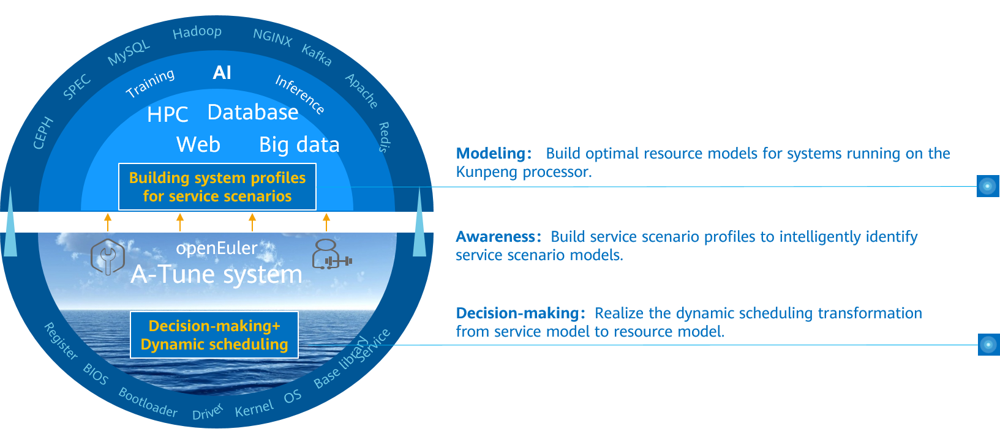

# Introduction

An operating system \(OS\) is basic software that connects applications and hardware. It is critical for users to adjust OS and application configurations and make full use of software and hardware capabilities to achieve optimal service performance. However, numerous workload types and varied applications run on the OS, and the requirements on resources are different. Currently, the application environment composed of hardware and software involves more than 7000 configuration objects. As the service complexity and optimization objects increase, the time cost for optimization increases exponentially. As a result, optimization efficiency decreases sharply. Optimization becomes complex and brings great challenges to users.

Second, as infrastructure software, the OS provides a large number of software and hardware management capabilities. The capability required varies in different scenarios. Therefore, capabilities need to be enabled or disabled depending on scenarios, and a combination of capabilities will maximize the optimal performance of applications.

In addition, the actual business embraces hundreds and thousands of scenarios, and each scenario involves a wide variety of hardware configurations for computing, network, and storage. The lab cannot list all applications, business scenarios, and hardware combinations.

To address the preceding challenges, openEuler launches A-Tune.

A-Tune is an AI-based engine that optimizes system performance. It uses AI technologies to precisely profile business scenarios, discover and infer business characteristics, so as to make intelligent decisions, match with the optimal system parameter configuration combination, and give recommendations, ensuring the optimal business running status.

