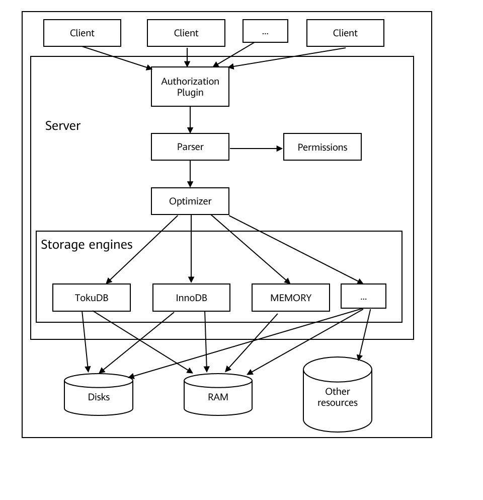

# Software Description

The MariaDB database management system is a branch of MySQL and is maintained by the open-source community. The MariaDB database management system uses the General Public License \(GPL\). MariaDB is designed to be fully compatible with MySQL, including APIs and command lines, so that it can easily replace MySQL. MariaDB also provides many new features.

[Figure 1](#fig13492418164520)  shows the MariaDB architecture.

**Figure  1**  MariaDB logical architecture  

When MariaDB receives a SQL statement, the execution process is as follows:

1.  When a client connects to MariaDB, the hostname, username, and password of the client are authenticated. The authentication function can be implemented as a plug-in.
2.  If the login is successful, the client sends SQL commands to the server. The parser parses the SQL statements.
3.  The server checks whether the client has the permission to obtain the required resources.
4.  If the query has been stored in the query cache, the result is returned immediately.
5.  The optimizer will find the fastest execution policy or plan. That is, the optimizer can determine which tables will be read, which indexes will be accessed, and which temporary tables will be used. A good policy can reduce a large number of disk access and sorting operations.
6.  Storage engines read and write data and index files. Caches are used to accelerate these operations. Other features such as transactions and foreign keys are processed at the storage engine layer.

Storage engines manage and control data at the physical layer. They manage data files, data, indexes, and caches, making data management and reading more efficient. Each table has a .frm file that contains table definitions.

Each storage engine manages and stores data in different ways, and supports different features and performance. For example:

-   MyISAM: suitable for environments with more reads and fewer writes. It does not support transactions and supports full-text indexes.
-   noDB: supports transactions, row locks, and foreign keys.
-   MEMORY: stores data in the memory.
-   CSV: stores data in CSV format.

