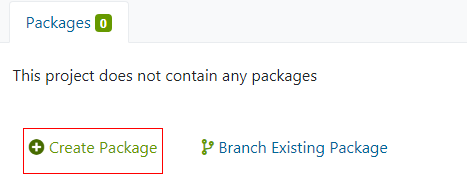
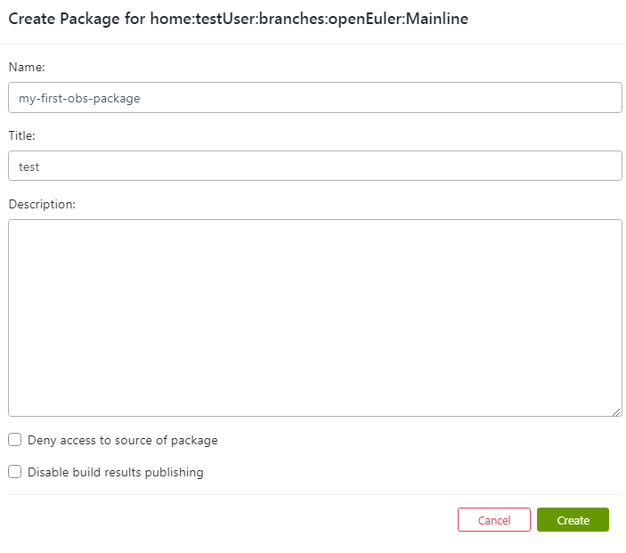

# Adding a Software Package

To add a new software package on the OBS web page, perform the following steps:

1.  Log in to the OBS console.
2.  Select a project based on the dependency of the new software package. That is, click  **All Projects**  and select the corresponding project, for example,  **openEuler:Mainline**.
3.  Click a software package in the project. The software package details page is displayed.
4.  Click  **Branch package**. On the confirmation page that is displayed, click  **Accept**.
5.  Click  **Delete package**  to delete the software package in the new subproject, as shown in  [Figure 1](#fig18306181103615).

    **Figure  1**  Deleting a software package from a subproject  
    

    > **NOTE:**   
    >The purpose of creating a project by using existing software is to inherit the dependency such as the environment. Therefore, you need to delete these files.  

6.  Click  **Create Package**. On the page that is displayed, enter the software package name, title, and description, and click  **Create**  to create a software package, as shown in  [Figure 2](#fig6762111693811)  and  [Figure 3](#fig18351153518389).

    **Figure  2** **Create Package**  page  
    

    **Figure  3**  Creating a software package  
    

7.  Click  **Add file**  to upload the .spec file and the file to be compiled \(specified in the .spec file\), as shown in  [Figure 4](#fig1475845284011).

    **Figure  4** **Add file**  page  
    

8.  After the file is uploaded, OBS automatically starts to build the RPM software package. Wait until the build is complete and view the build status in the status bar on the right.
    -   **succeeded**: The build is successful. You can click  **succeeded**  to view the build logs.
    -   **failed**: The build failed. Click  **failed**  to view error logs, locate the fault, and rebuild again.
    -   **unresolvable**: The build is not performed. The possible cause is that the dependency is missing.
    -   **disabled**: The build is manually closed or is queuing for build.
    -   **excluded**: The build is prohibited. The possible cause is that the .spec file is missing or the compilation of the target architecture is prohibited in the .spec file.

