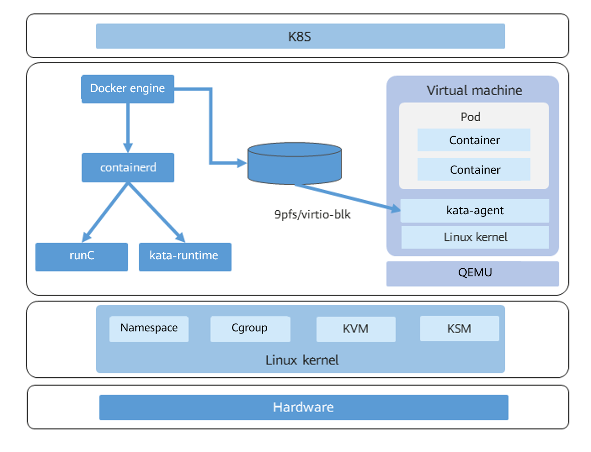
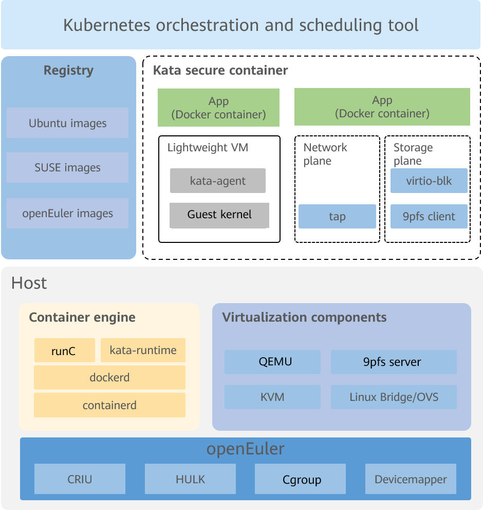

# Overview

The secure container technology is an organic combination of virtualization and container technologies. Compared with a common Linux container, a secure container has better isolation performance.

Common Linux containers use namespaces to isolate the running environment between processes and use cgroups to limit resources. Essentially, these common Linux containers share the same kernel. Therefore, if a single container affects the kernel intentionally or unintentionally, the containers on the same host will be affected.

Secure containers are isolated by the virtualization layers. Containers on the same host do not affect each other.

**Figure  1**  Secure container architecture  

Secure containers are closely related to the concept of pod in Kubernetes. Kubernetes is the open-source ecosystem standard for the container scheduling management platform. It defines a group of container runtime interfaces \(CRIs\).

In the CRI standards, a pod is a logical grouping of one or more containers, which are scheduled together and share interprocess communication \(IPC\) and network namespaces. As the smallest unit for scheduling, a pod must contain a pause container and one or more service containers. The lifecycle of a pause container is the same as that of the pod.

A lightweight virtual machine \(VM\) in a secure container is a pod. The first container started in the VM is the pause container, and the containers started later are service containers.

In a secure container, you can start a single container or start a pod.

[Figure 2](#fig17734185518269)  shows the relationship between the secure container and peripheral components.

**Figure  2**  Relationship between the secure container and peripheral components  

