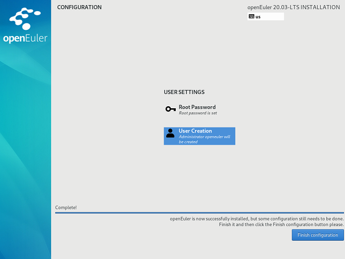

# Configurations During Installation<a name="EN-US_TOPIC_0229291195"></a>

After the installation starts, the overall installation progress and the progress of writing the software package to the system are displayed.

**Figure  1**  Installation process<a name="en-us_topic_0186390266_en-us_topic_0122145909_fig1590863119306"></a>  


During the process of installing software packages, you need to configure the root password and create users.

## Password Complexity<a name="en-us_topic_0186390266_en-us_topic_0122145909_sde5f91f1b197422180f50c693caff342"></a>

The password of the  **root**  user or the password of the new user must meet the password complexity requirements. Otherwise, the password configuration or user creation will fail. The password complexity requirements are as follows:

1.  A password must contain at least eight characters.
2.  A password must contain at least three of the following types: uppercase letters, lowercase letters, digits, and special characters.
3.  A password must be different from the account name.
4.  A password cannot contain words in the dictionary.
    -   Querying a dictionary

        In the installed openEuler environment, you can run the following command to export the dictionary library file  **dictionary.txt**, and then check whether the password is in the dictionary.

        ```
        cracklib-unpacker /usr/share/cracklib/pw_dict > dictionary.txt
        ```

    -   Modifying a dictionary
        1.  Modify the exported dictionary library file, and then run the following command to update the dictionary library:

            ```
            # create-cracklib-dict dictionary.txt
            ```

        2.  Run the following command to add another dictionary file  **custom.txt**  to the original dictionary library.

            ```
            # create-cracklib-dict dictionary.txt custom.txt
            ```


## Setting the Root User Password<a name="en-us_topic_0186390266_en-us_topic_0122145909_sba63f974590848d1a6110d6aa9d145ab"></a>

Click  **Root Password**. In the displayed dialog box, as shown in  [Figure 2](#en-us_topic_0186390266_en-us_topic_0122145909_fig1323165793018), enter a password and re-enter to confirm.

> **NOTE:**   
>The root password is required to be configured at the same time of installing software packages. Otherwise, the installation will fail. A  **root**  account is used for performing critical system administration tasks. It is not recommended to use this account for daily work or system access.  

**Figure  2**  Password of the  **root**  account<a name="en-us_topic_0186390266_en-us_topic_0122145909_fig1323165793018"></a>  


After configuration, click  **Done**  in the left-upper corner to switch back to the installation process page.

## Creating a User<a name="en-us_topic_0186390266_en-us_topic_0122145909_sb88f63af2daa4e55959c0bb72fea0a52"></a>

Click  **User Creation**.  [Figure 3](#en-us_topic_0186390266_en-us_topic_0122145909_fig1237715313319)  shows the page for creating a user. Enter a username and set a password. By clicking  **Advanced**, you can also configure a home directory and a user group, as shown in  [Figure 4](#en-us_topic_0186390266_en-us_topic_0122145909_fig128716531312).

**Figure  3**  Creating a user<a name="en-us_topic_0186390266_en-us_topic_0122145909_fig1237715313319"></a>  


**Figure  4**  Advanced user configuration<a name="en-us_topic_0186390266_en-us_topic_0122145909_fig128716531312"></a>  


After configuration, click  **Done**  in the left-upper corner to switch back to the installation process page.

Click  **Finish**. The configuration of openEuler is complete.



