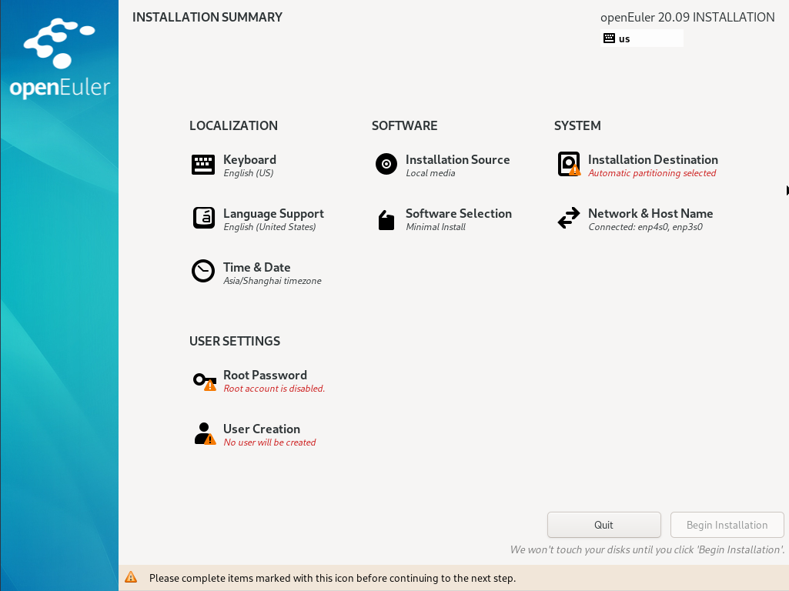
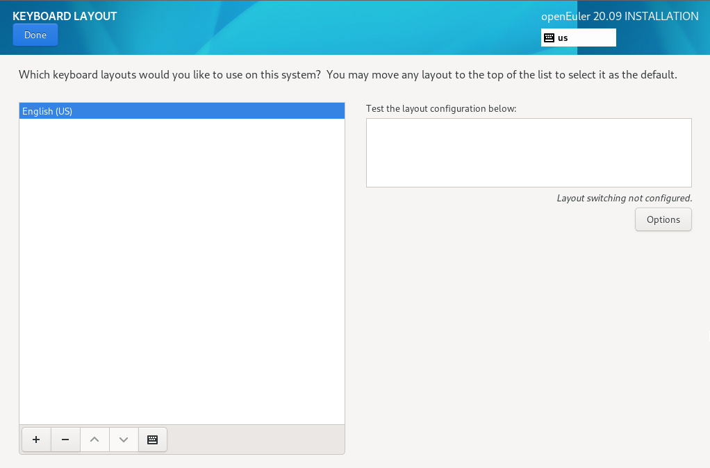
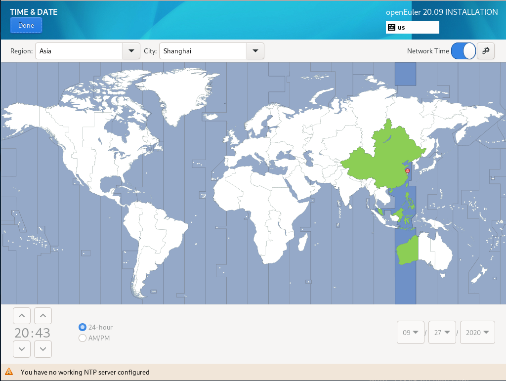
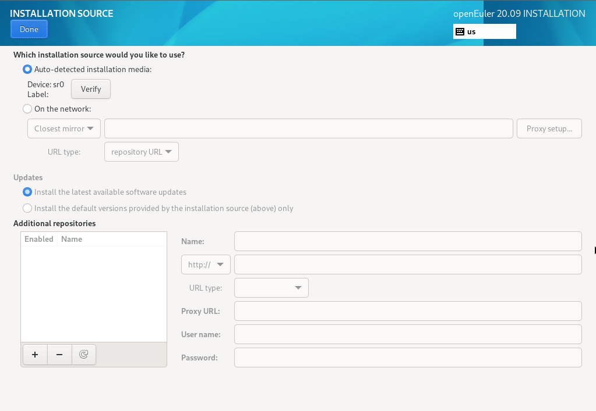
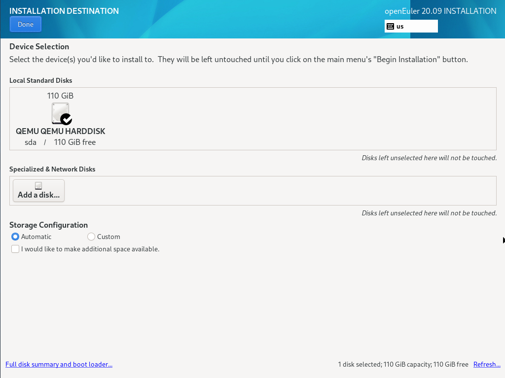
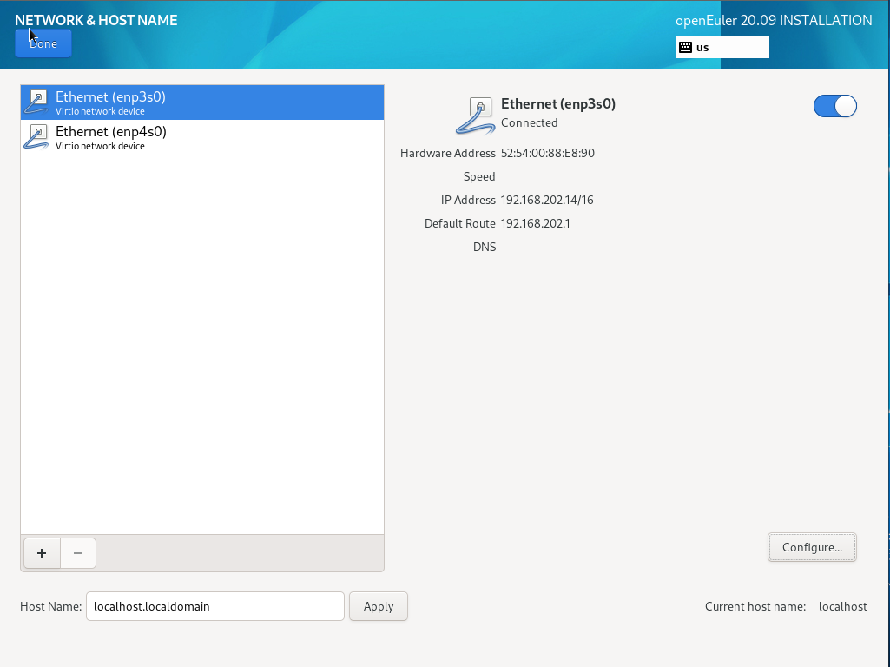
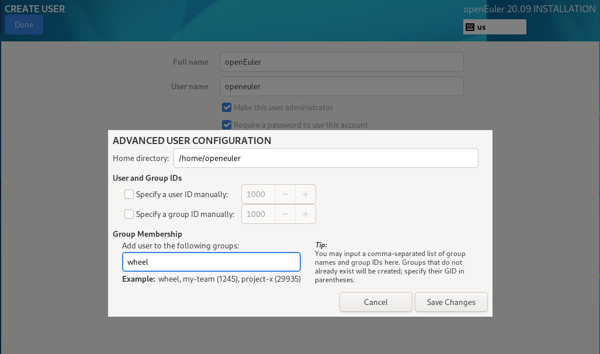
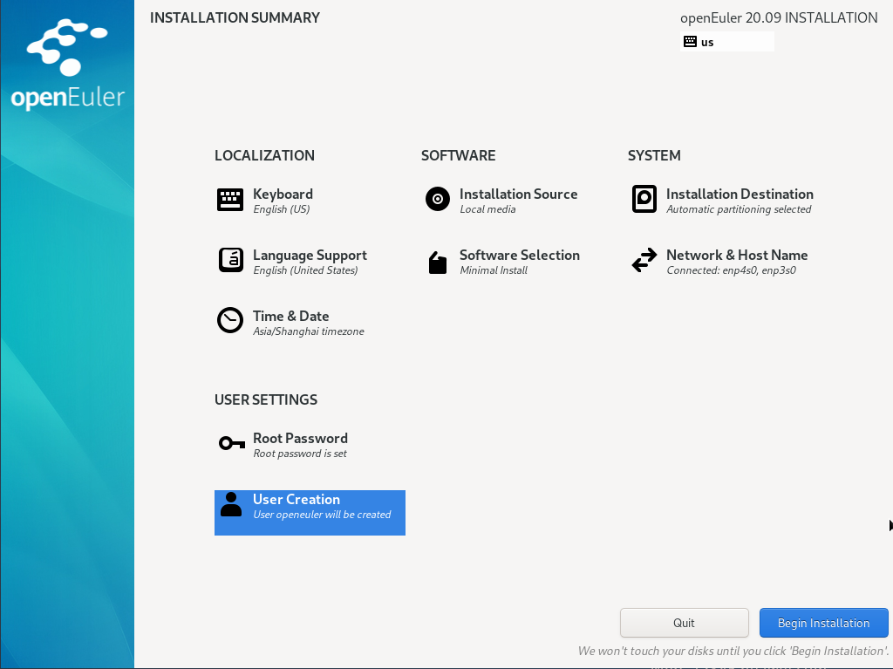

# Installation Guideline

This section describes how to install openEuler using a CD-ROM. The installation process is the same for other installation modes except the boot option.

<!-- TOC -->

- [Installation Guideline](#installation-guideline)
  - [Starting the Installation](#starting-the-installation)
    - [Booting from the CD/DVD-ROM Drive](#booting-from-the-cddvd-rom-drive)
    - [Installation Wizard](#installation-wizard)
    - [Installation in GUI Mode](#installation-in-gui-mode)
  - [Configuring an Installation Program Language](#configuring-an-installation-program-language)
  - [Entering the Installation Page](#entering-the-installation-page)
  - [Setting the Keyboard Layout](#setting-the-keyboard-layout)
  - [Setting a System Language](#setting-a-system-language)
  - [Setting Date and Time](#setting-date-and-time)
  - [Setting the Installation Source](#setting-the-installation-source)
  - [Selecting Installation Software](#selecting-installation-software) 
  - [Setting the Installation Destination](#setting-the-installation-destination)
    - [Storage Configuration](#storage-configuration)
  - [Setting the Network and Host Name](#setting-the-network-and-host-name)
  - [Setting the Root Password](#设置根密码)
    - [Password Complexity](#密码复杂度)
  - [Creating a User](#创建用户)
  - [Starting the Installation](#开始安装)
  - [Installation Procedure](#安装过程)
  - [Completing the Installation](#安装完成)

<!-- /TOC -->
## Starting the Installation

### Booting from the CD/DVD-ROM Drive

Load the ISO image of openEuler from the CD/DVD-ROM drive of the server and restart the server. The procedure is as follows:

>  **NOTE:**   
Before the installation, ensure that the server boots from the CD/DVD-ROM drive preferentially. The following steps describe how to install the openEuler using the virtual CD/DVD-ROM drive on the baseboard management controller (BMC). Installing the openEuler from a physical drive is simple. After the installation starts, the procedure for the physical drive is the same as that of the virtual drive.  

1.  On the toolbar, click the icon shown in the following figure.

    **Figure  1**  Drive icon  
    

    An image dialog box is displayed, as shown in the following figure.

    **Figure  2**  Image dialog box  
    

2.  Select  **Image File**  and then click  **Browse**. The  **Open**  dialog box is displayed.

3.  Select the image file and click  **Open**. In the image dialog box, click  **Connect**. If  **Connect**  changes to  **Disconnect**, the virtual CD/DVD-ROM drive is connected to the server.

4.  On the toolbar, click the restart icon shown in the following figure to restart the device.

    **Figure  3**  Restart icon  
    

### Installation Wizard

A boot menu is displayed after the system is booted using the boot medium. In addition to options for starting the installation program, some other options are available on the boot menu. During system installation, the  **Test this media \& install openEuler 20.09**  mode is used by default. Press the arrow keys on the keyboard to change the selection, and press  **Enter**  when the desired option is highlighted.

> **NOTE:**  
> 
>-   If you do not perform any operations within 1 minute, the system automatically selects the default option  **Test this media \& install openEuler 20.09**  and enters the installation page.  
>-   During PM installation, if you cannot use the arrow keys to select boot options and the system does not respond after you press  **Enter**, click    on the BMC page and configure  **Key & Mouse Reset**.  

**Figure  4**  Installation Wizard  

Installation wizard options are described as follows:

-   **Install openEuler 20.09**: Install openEuler on your server in GUI mode.

-   **Test this media & install openEuler 20.09**: Default option. Install openEuler on your server in GUI mode. The integrity of the installation medium is checked before the installation program is started.

-   **Troubleshooting**: Troubleshooting mode, which is used when the system cannot be installed properly. In troubleshooting mode, the following options are available:
    
    -   **Install openEuler 20.09 in basic graphics mode**: Basic graphics installation mode. In this mode, the video driver is not started before the system starts and runs.
    -   **Rescue the openEuler system**: Rescue mode, which is used to restore the system. In rescue mode, the installation process is printed in the VNC or BMC, and the serial port is unavailable.

On the installation wizard screen, press  **e**  to go to the parameter editing screen of the selected option, and press  **c**  to go to the command-line interface (CLI). 

### Installation in GUI Mode

On the installation wizard page, select  **Test this media \& install openEuler 20.09**  to enter the GUI installation mode.

Perform graphical installation operations using a keyboard.

-   Press  **Tab**  or  **Shift**+**Tab**  to move between GUI controls (such as buttons, area boxes, and check boxes).
-   Press the up or down arrow key to move a target in the list.
-   Press the left or right arrow key to move between the horizontal toolbar and watch bar.
-   Press the spacebar or  **Enter**  to select or delete highlighted options, expand or collapse a drop-down list.
-   Press  **Alt**+a shortcut key (the shortcut key varies for different pages) to select the control where the shortcut key is located. The shortcut key can be highlighted (underlined) by holding down Alt.

## Configuring an Installation Program Language

After the installation starts, the system will prompt the language that is used during the configuration installation process. English is configured by default, as shown in  [Figure 5](#en-us_topic_0186390093_en-us_topic_0122145864_fig144630179151). Configure another language as required.

**Figure  5**  Selecting a language  

After configurations, click  **Continue**. The main installation configuration page is displayed.

If you want to exit the installation, click  **Exit**. The message "Are you sure you want to exit the installation program?" is displayed. Click  **Yes**  in the dialog box to go back to the installation wizard page.

## Entering the Installation Page

After the installation program starts, the main installation configuration page is displayed, as shown in  [Figure 6](#en-us_topic_0186390094_en-us_topic_0122145883_fig5969171592212). On the page, you can configure the time, language, installation source, network, and storage device.

Some configuration items are matched with safety symbols. A safety symbol will disappear after the item is configured. Start the installation only when all the safety symbols disappear from the page.

If you want to exit the installation, click  **Exit**. The message "Are you sure you want to exit the installation program?" is displayed. Click  **Yes**  in the dialog box to go back to the installation wizard page.

**Figure  6**  Installation summary  

## Setting the Keyboard Layout

On the  **INSTALLATION SUMMARY**  page, click  **KEYBOARD**. You can add or delete multiple keyboard layouts in the system.

- On the left white box, click to select the keyboard layout and click the keyboard under the box.
- To test the keyboard layout: On the left white box, click to select the keyboard layout, click the inside of the right text box, and enter the text to ensure that the keyboard layout can work properly.

**Figure  7**  Setting the keyboard layout  

After the setting is complete, click  **Done**  in the upper left corner to go back to the  **INSTALLATION SUMMARY**  page.

## Setting a System Language

On the  **INSTALLATION SUMMARY**  page, click  **LANGUAGE SUPPORT**  to set the system language, as shown in  [Figure 8](#en-us_topic_0186390098_en-us_topic_0122145772_fig187301927172619). Set another language as required, such as Chinese.

> **NOTE:**   
>
> - If you select **Chinese**, the system does not support the display of Chinese characters when you log in to the system using VNC, but supports the display of Chinese characters when you log in to the system using a serial port. When you log in to the system using SSH, whether the system supports the display of Chinese characters depends on the SSH client. If you select **English**, the display is not affected.  

**Figure  8**  Setting a system language  

After the setting is complete, click  **Done**  in the upper left corner to go back to the  **INSTALLATION SUMMARY**  page.

## Setting Date and Time

On the  **INSTALLATION SUMMARY**  page, click  **TIME \& DATE**. On the  **TIME \& DATE**  page, set the system time zone, date, and time.

When setting the time zone, you can click a specific city on the map with the mouse, or select a region from the drop-down list of  **Region**  or a city from the drop-down list of  **City**  at the top of the page, as shown in  [Figure 9](#en-us_topic_0186390096_en-us_topic_0122145900_fig1260162652312).

If your city is not displayed on the map or in the drop-down list, select the nearest city in the same time zone.

> **NOTE:**   
>
>- Before manually setting the time zone, disable the network time synchronization function in the upper right corner.  
>- If you want to use the network time, ensure that the network can connect to the remote NTP server. For details about how to set the network, see [Setting the Network and Host Name](#setting-the-network-and-host-name).  

**Figure  9**  Setting date and time  

After the setting is complete, click  **Done**  in the upper left corner to go back to the  **INSTALLATION SUMMARY**  page.

## Setting the Installation Source

On the  **INSTALLATION SUMMARY**  page, click  **INSTALLATION SOURCE**  to locate the installation source.

If you use a CD/DVD-ROM for installation, the installation program automatically detects and displays the installation source information. You can use the default settings.  [Figure 10](#en-us_topic_0186390100_en-us_topic_0144427079_fig93633295132)  shows an example.

**Figure  10**  Setting the installation source  

When you use the network for installation, if the HTTPS server uses a private certificate, press  **e**  on the installation wizard page to go to the parameter editing page and add the  **inst.noverifyssl**  parameter, as shown in  [Figure 11](#fig113517811415).

**Figure  11**  Adding the  **inst.noverifyssl**  parameter  

After the setting is complete, click  **Done**  in the upper left corner to go back to the  **INSTALLATION SUMMARY**  page.

> **NOTE:**   
During the installation, if you have any questions about configuring the installation source, see [An Exception Occurs During the Selection of the Installation Source](faqs.html#an-exception-occurs-during-the-selection-of-the-installation-source).  

## Selecting Installation Software

On the  **INSTALLATION SUMMARY**  page, click  **SOFTWARE SELECTION**  to specify the software package to be installed.

Based on the actual requirements, select  **Minimal Install**  on the left box and select an add-on in the  **Add-Ons for Selected Environment**  area on the right, as shown in  [Figure 12](#en-us_topic_0186390261_en-us_topic_0122145865_fig03031519101414).

**Figure  12**  Selecting installation software  

>  **NOTE:**   
>- In  **Minimal Install**  mode, not all packages in the installation source will be installed. If the required package is not installed, you can mount the installation source to the local PC and configure a repo source, and use DNF to install the package.  
>- If you select  **Virtual Host**, the virtualization components QEMU, libvirt, and edk2 are installed by default. You can select whether to install the OVS component in the add-on area.  

After the setting is complete, click  **Done**  in the upper left corner to go back to the  **INSTALLATION SUMMARY**  page.

## Setting the Installation Destination

On the  **INSTALLATION SUMMARY**  page, click  **INSTALLATION DESTINATION**  to select the OS installation disk and partition.

You can view available local storage devices in  [Figure 13](#fig1195417125015).

>  **NOTICE:**
When selecting the device to be installed, you are advised not to use the NVMe SSD storage medium as the OS installation disk.  

**Figure  13**  Setting the installation destination  

### Storage Configuration

On the  **INSTALLATION DESTINATION**  page, configure storage for system partition. You can either manually configure partitions or select  **Automatic**  to automatically configure partitioning.

>  **NOTE:**   
>
> - During partitioning, to ensure system security and performance, you are advised to divide the device into the following partitions:  **/boot**,  **/var**,  **/var/log**,  **/var/log/audit**,  **/home**, and  **/tmp**.  
> - If the system is configured with the swap partition, the swap partition is used when the physical memory of the system is insufficient. Although the swap partition can be used to expand the physical memory, if the swap partition is used due to insufficient memory, the system response slows and the system performance deteriorates. Therefore, you are not advised to configure the swap partition in the system with sufficient physical memory or the performance sensitive system.  
> - If you need to split a logical volume group, select  **Custom**  to manually partition the logical volume group. On the  **MANUAL PARTITIONING**  page, click  **Modify**  in the  **Volume Group**  area to reconfigure the logical volume group.  

**Automatic**

Select  **Automatic**  if the software is installed in a new storage device or the data in the storage device is not required. After the setting is complete, click  **Done**  in the upper left corner to go back to the  **INSTALLATION SUMMARY**  page.

**Customize**

If you need to manually partition the disk, click  **Customize**  and click  **Done**  in the upper left corner. The following page is displayed.

On the  **MANUAL PARTITIONING**  page, you can partition the disk in either of the following ways. After the partitioning is completed, the window shown in [Figure 14](#fig1277151815248) is displayed.

- Automatic creation: Click  **Click here to create them automatically**. The system automatically assigns four mount points according to the available storage space:  **/boot**,  **/**,  **/boot/efi**, and  **swap**.
- Manual creation: Click    to add a mount point. It is recommended that the expected capacity of each mount point not exceed the available space.

  > **NOTE:**   
If the expected capacity of the mount point exceeds the available space, the system allocates the remaining available space to the mount point.  

**Figure 14** Manual partitioning  

After the setting is complete, click  **Done**  in the upper left corner to go back to the  **SUMMARY OF CHANGES**  page.

**Figure 15** Manual partitioning  

click  **Accept Changes**  to go back to the  **INSTALLATION SUMMARY**  page.

## Setting the Network and Host Name

On the  **INSTALLATION SUMMARY**  page, select  **NETWORK \& HOST NAME**  to configure the system network functions.

The installation program automatically detects a local access interface. The detected interface is listed in the left box, and the interface details are displayed in the right-hand area, as shown in  [Figure 16](#en-us_topic_0186390264_en-us_topic_0122145831_fig123700157297). In the upper right corner, click the switchover button to enable or disable the network interface. You can also click  **Configure**  to configure the selected interface.

In the lower left box, enter the host name. The host name can be the fully quantified domain name (FQDN) in the format of hostname.domainname or the brief host name in the format of hostname.

**Figure  16**  Setting the network and host name  

After the setting is complete, click **Done** in the upper left corner to go back to the **INSTALLATION SUMMARY** page.

## Setting the Root Password

Select **Root Password** on the **INSTALLATION SUMMARY** page. The **Root Password** page is displayed, as shown in [Figure 17](#zh-cn_topic_0186390266_zh-cn_topic_0122145909_fig1323165793018). Enter a password based on [Password Complexity](#密码复杂度) requirements and confirm the password.

>  **NOTE:**
> 
> - The root account is used to perform key system management tasks. You are not advised to use the root account for daily work or system access.
> 
> - If you select **Lock root account** on the **Root Password** page, the root account will be disabled.

**Figure 17** Root password  

### Password Complexity

The password of the  **root**  user or the password of the new user must meet the password complexity requirements. Otherwise, the password configuration or user creation will fail. The password complexity requirements are as follows:

1.  A password must contain at least eight characters.

2.  A password must contain at least three of the following types: uppercase letters, lowercase letters, digits, and special characters.

3.  A password must be different from the account name.

4.  A password cannot contain words in the dictionary.

    > **NOTE:**   
In the installed openEuler environment, you can run the `cracklib-unpacker /usr/share/cracklib/pw_dict > dictionary.txt` command to export the dictionary library file  **dictionary.txt**, and then check whether the password is in the dictionary.

After the settings are completed, click **Done** in the upper left corner to return to the **INSTALLATION SUMMARY** page.

## Creating a User

Click  **User Creation**.  [Figure 18](#en-us_topic_0186390266_en-us_topic_0122145909_fig1237715313319)  shows the page for creating a user. Enter a username and set a password. By clicking  **Advanced**, you can also configure a home directory and a user group, as shown in  [Figure 19](#en-us_topic_0186390266_en-us_topic_0122145909_fig128716531312).

**Figure  18**  Creating a user  

**Figure  19**  Advanced user configuration  

After configuration, click  **Done**  in the left-upper corner to switch back to the installation process page.

## Starting Installation

On the installation page, after all the mandatory items are configured, the safety symbols will disappear. Then, you can click  **Begin Installation**  to install the system.

**Figure  20**  Starting installation  

## Installation Procedure

After the installation starts, the overall installation progress and the progress of writing the software package to the system are displayed. 

  > **NOTE:**    
If you click **Exit** or reset or power off the server during the installation, the installation is interrupted and the system is unavailable. In this case, you need to reinstall the system.

**Figure  21**  Installation process  

## Completing the Installation

openEuler has been installed, as shown in  [Figure 22](#en-us_topic_0186390267_en-us_topic_0122145917_fig1429512116338). Click  **Reboot**  to restart the system.

**Figure  22**  Completing the installation  

-   If the physical DVD-ROM is used to install the OS and the DVD-ROM drive is not automatically ejected during the restart, manually remove the DVD-ROM. Then, the openEuler CLI login page is displayed.
-   If the virtual DVD-ROM drive is used to install the OS, change the server boot option to  **Hard Disk**  and restart the server. Then, the openEuler CLI login page is displayed.
