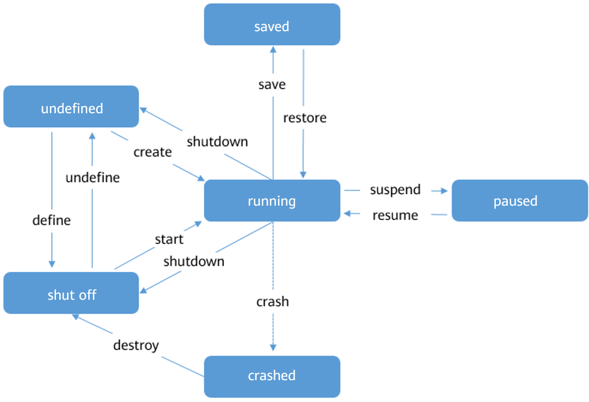

# Introduction

## Overview

To leverage hardware resources and reduce costs, users need to properly manage VMs. This section describes basic operations during the VM lifecycle, such as creating, using, and deleting VMs.

## VM Status

A VM can be in one of the following status:

-   **undefined**: The VM is not defined or created. That is, libvirt considers that the VM does not exist.
-   **shut off**: The VM has been defined but is not running, or the VM is terminated.
-   **running**: The VM is running.
-   **paused**: The VM is suspended and its running status is temporarily stored in the memory. The VM can be restored to the running status.
-   **saved**: Similar to the  **paused**  status, the running state is stored in a persistent storage medium and can be restored to the running status.
-   **crashed**: The VM crashes due to an internal error and cannot be restored to the running status.

## Status Transition

VMs in different status can be converted, but certain rules must be met.  [Figure 1](#fig671014583483)  describes the common rules for transiting the VM status.

**Figure  1**  Status transition diagram  

## VM ID

In libvirt, a created VM instance is called a  **domain**, which describes the configuration information of resources such as the CPU, memory, network device, and storage device of the VM. On a host, each domain has a unique ID, which is represented by the VM  **Name**,  **UUID**, and  **Id**. For details, see  [Table 1](#table84397266483). During the VM lifecycle, an operation can be performed on a specific VM by using a VM ID.

**Table  1**  Domain ID description

<table><thead align="left"><tr id="row194391726114819"><th class="cellrowborder" valign="top" width="24.57%" id="mcps1.2.3.1.1">
ID

</th>
<th class="cellrowborder" valign="top" width="75.42999999999999%" id="mcps1.2.3.1.2">
Description

</th>
</tr>
</thead>
<tbody><tr id="row143972684815"><td class="cellrowborder" valign="top" width="24.57%" headers="mcps1.2.3.1.1 ">
Name

</td>
<td class="cellrowborder" valign="top" width="75.42999999999999%" headers="mcps1.2.3.1.2 ">
VM name

</td>
</tr>
<tr id="row1644092654815"><td class="cellrowborder" valign="top" width="24.57%" headers="mcps1.2.3.1.1 ">
UUID

</td>
<td class="cellrowborder" valign="top" width="75.42999999999999%" headers="mcps1.2.3.1.2 ">
Universally unique identifier

</td>
</tr>
<tr id="row12440626154811"><td class="cellrowborder" valign="top" width="24.57%" headers="mcps1.2.3.1.1 ">
Id

</td>
<td class="cellrowborder" valign="top" width="75.42999999999999%" headers="mcps1.2.3.1.2 ">
VM running ID

 NOTE: 

The ID is not displayed for a powered off VM.

</td>
</tr>
</tbody>
</table>

> **NOTE:**   
>Run the  **virsh**  command to query the VM ID and UUID. For details, see  [Querying VM Information](querying-vm-information.md).  

