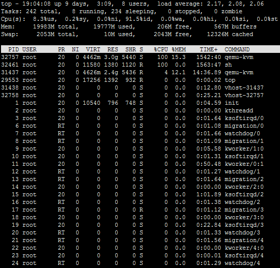

# 管理进程

操作系统管理多个用户的请求和多个任务。大多数系统都只有一个CPU和一个主要存储，但一个系统可能有多个二级存储磁盘和多个输入/输出设备。操作系统管理这些资源并在多个用户间共享资源，当用户提出一个请求时，造成好像系统被用户独占的假象。实际上操作系统监控着一个等待执行的任务队列，这些任务包括用户任务、操作系统任务、邮件和打印任务等。本章节将从用户的角度讲述如何控制进程。
<!-- TOC -->

- [管理进程](#管理进程)
    - [查看进程](#查看进程)
        - [who命令](#who命令)
        - [ps命令](#ps命令)
        - [top命令](#top命令)
        - [kill命令](#kill命令)
    - [调度启动进程](#调度启动进程)
        - [定时运行一批程序（at）](#定时运行一批程序at)
        - [周期性运行一批程序（cron）](#周期性运行一批程序cron)
    - [挂起/恢复进程](#挂起恢复进程)

<!-- /TOC -->
## 查看进程

Linux是一个多任务系统，经常需要对这些进程进行一些调配和管理。要进行管理，首先就要知道现在的进程情况：有哪些进程、进程的状态如何等。Linux提供了多种命令来了解进程的状况。

### who命令

who命令主要用于查看当前系统中的用户情况。如果用户想和其他用户建立即时通讯，比如使用talk命令，那么首先要确定的就是该用户确实在线上，不然talk进程就无法建立起来。又如，系统管理员希望监视每个登录的用户此时此刻的所作所为，也要使用who命令。who命令应用起来非常简单，可以比较准确地掌握用户的情况，所以使用非常广泛。

例如查看系统中的用户及其状态。使用如下：

```
# who
admin     tty1         Jul 28 15:55
admin     pts/0        Aug  5 15:46 (192.168.0.110)
admin     pts/2        Jul 29 19:52 (192.168.0.110)
root     pts/3        Jul 30 12:07 (192.168.0.110)
root     pts/4        Jul 31 10:29 (192.168.0.144)
root     pts/5        Jul 31 14:52 (192.168.0.11)
root     pts/6        Aug  6 10:12 (192.168.0.234)
root     pts/8        Aug  6 11:34 (192.168.0.234)
```

### ps命令

ps命令是最基本又非常强大的进程查看命令。使用该命令可以确定有哪些进程正在运行和运行的状态、进程是否结束、进程有没有僵尸、哪些进程占用了过多的资源等，大部分进程信息都是可以通过执行该命令得到的。

ps命令最常用的还是用来监控后台进程的工作情况，因为后台进程是不与屏幕、键盘这些标准输入/输出设备进行通信的，所以如果需要检测其状况，就可使用ps命令。ps命令的常见选项如[表1](#zh-cn_topic_0151921029_t34619d964a3d41ad8694189ec383359c)所示。

**表 1**  选项说明

<a name="zh-cn_topic_0151921029_t34619d964a3d41ad8694189ec383359c"></a>
<table><thead align="left"><tr id="zh-cn_topic_0151921029_r79d809c7e44245b1bbf90aac5b57cb16"><th class="cellrowborder" valign="top" width="18.61%" id="mcps1.2.3.1.1"><p id="zh-cn_topic_0151921029_a4dcafe9758654440a1cd09443b49b996"><a name="zh-cn_topic_0151921029_a4dcafe9758654440a1cd09443b49b996"></a><a name="zh-cn_topic_0151921029_a4dcafe9758654440a1cd09443b49b996"></a>选项</p>
</th>
<th class="cellrowborder" valign="top" width="81.39%" id="mcps1.2.3.1.2"><p id="zh-cn_topic_0151921029_ac6fdbea1258d4c3ca520255a2d2fe663"><a name="zh-cn_topic_0151921029_ac6fdbea1258d4c3ca520255a2d2fe663"></a><a name="zh-cn_topic_0151921029_ac6fdbea1258d4c3ca520255a2d2fe663"></a>描述</p>
</th>
</tr>
</thead>
<tbody><tr id="zh-cn_topic_0151921029_r738b90e22f614e77b9ea21359ad14755"><td class="cellrowborder" valign="top" width="18.61%" headers="mcps1.2.3.1.1 "><p id="zh-cn_topic_0151921029_a29392e63172746c491bc46c8b76b0080"><a name="zh-cn_topic_0151921029_a29392e63172746c491bc46c8b76b0080"></a><a name="zh-cn_topic_0151921029_a29392e63172746c491bc46c8b76b0080"></a>-e</p>
</td>
<td class="cellrowborder" valign="top" width="81.39%" headers="mcps1.2.3.1.2 "><p id="zh-cn_topic_0151921029_a512f7ef0b90a4cb7bf17fa20f4775725"><a name="zh-cn_topic_0151921029_a512f7ef0b90a4cb7bf17fa20f4775725"></a><a name="zh-cn_topic_0151921029_a512f7ef0b90a4cb7bf17fa20f4775725"></a>显示所有进程。</p>
</td>
</tr>
<tr id="zh-cn_topic_0151921029_r015cec7c7ac44cbca03a8af4cd753492"><td class="cellrowborder" valign="top" width="18.61%" headers="mcps1.2.3.1.1 "><p id="zh-cn_topic_0151921029_a068031d192014fe8a886ae267635afde"><a name="zh-cn_topic_0151921029_a068031d192014fe8a886ae267635afde"></a><a name="zh-cn_topic_0151921029_a068031d192014fe8a886ae267635afde"></a>-f</p>
</td>
<td class="cellrowborder" valign="top" width="81.39%" headers="mcps1.2.3.1.2 "><p id="zh-cn_topic_0151921029_a474a7023a5fd41258427e511f0b4d79c"><a name="zh-cn_topic_0151921029_a474a7023a5fd41258427e511f0b4d79c"></a><a name="zh-cn_topic_0151921029_a474a7023a5fd41258427e511f0b4d79c"></a>全格式。</p>
</td>
</tr>
<tr id="zh-cn_topic_0151921029_rec7c0b7251f743e4b6d3d41dc44c7e9f"><td class="cellrowborder" valign="top" width="18.61%" headers="mcps1.2.3.1.1 "><p id="zh-cn_topic_0151921029_af814f2f50cc44408999eb08d9d0a2a2a"><a name="zh-cn_topic_0151921029_af814f2f50cc44408999eb08d9d0a2a2a"></a><a name="zh-cn_topic_0151921029_af814f2f50cc44408999eb08d9d0a2a2a"></a>-h</p>
</td>
<td class="cellrowborder" valign="top" width="81.39%" headers="mcps1.2.3.1.2 "><p id="zh-cn_topic_0151921029_ab4f39caa92d54d2ea6b3c093e55d618e"><a name="zh-cn_topic_0151921029_ab4f39caa92d54d2ea6b3c093e55d618e"></a><a name="zh-cn_topic_0151921029_ab4f39caa92d54d2ea6b3c093e55d618e"></a>不显示标题。</p>
</td>
</tr>
<tr id="zh-cn_topic_0151921029_r38d5c83acc40447abba5cca0c4386932"><td class="cellrowborder" valign="top" width="18.61%" headers="mcps1.2.3.1.1 "><p id="zh-cn_topic_0151921029_a2a631b086f1942b6b81eafb5dbabdcd0"><a name="zh-cn_topic_0151921029_a2a631b086f1942b6b81eafb5dbabdcd0"></a><a name="zh-cn_topic_0151921029_a2a631b086f1942b6b81eafb5dbabdcd0"></a>-l</p>
</td>
<td class="cellrowborder" valign="top" width="81.39%" headers="mcps1.2.3.1.2 "><p id="zh-cn_topic_0151921029_a09dc585737284fad909909e50c803bc2"><a name="zh-cn_topic_0151921029_a09dc585737284fad909909e50c803bc2"></a><a name="zh-cn_topic_0151921029_a09dc585737284fad909909e50c803bc2"></a>使用长格式。</p>
</td>
</tr>
<tr id="zh-cn_topic_0151921029_r2e38bfe71fa94287ac2147781f1a53c1"><td class="cellrowborder" valign="top" width="18.61%" headers="mcps1.2.3.1.1 "><p id="zh-cn_topic_0151921029_a188698ebfa154b02a7841a551ab484da"><a name="zh-cn_topic_0151921029_a188698ebfa154b02a7841a551ab484da"></a><a name="zh-cn_topic_0151921029_a188698ebfa154b02a7841a551ab484da"></a>-w</p>
</td>
<td class="cellrowborder" valign="top" width="81.39%" headers="mcps1.2.3.1.2 "><p id="zh-cn_topic_0151921029_ab88d108c1ce744cdb50047050bc0cd9b"><a name="zh-cn_topic_0151921029_ab88d108c1ce744cdb50047050bc0cd9b"></a><a name="zh-cn_topic_0151921029_ab88d108c1ce744cdb50047050bc0cd9b"></a>宽行输出。</p>
</td>
</tr>
<tr id="zh-cn_topic_0151921029_r84c7a5f140c44fb598620f34927af667"><td class="cellrowborder" valign="top" width="18.61%" headers="mcps1.2.3.1.1 "><p id="zh-cn_topic_0151921029_a811383eb9caa4ad583b1e5de91ea5dd4"><a name="zh-cn_topic_0151921029_a811383eb9caa4ad583b1e5de91ea5dd4"></a><a name="zh-cn_topic_0151921029_a811383eb9caa4ad583b1e5de91ea5dd4"></a>-a</p>
</td>
<td class="cellrowborder" valign="top" width="81.39%" headers="mcps1.2.3.1.2 "><p id="zh-cn_topic_0151921029_aa07844184ac64000a161e1c1291675e3"><a name="zh-cn_topic_0151921029_aa07844184ac64000a161e1c1291675e3"></a><a name="zh-cn_topic_0151921029_aa07844184ac64000a161e1c1291675e3"></a>显示终端上的所有进程，包括其他用户的进程。</p>
</td>
</tr>
<tr id="zh-cn_topic_0151921029_rd13fe771cf744239858d51db76b25f8e"><td class="cellrowborder" valign="top" width="18.61%" headers="mcps1.2.3.1.1 "><p id="zh-cn_topic_0151921029_ab886c758505744f4b37c512bde114ae3"><a name="zh-cn_topic_0151921029_ab886c758505744f4b37c512bde114ae3"></a><a name="zh-cn_topic_0151921029_ab886c758505744f4b37c512bde114ae3"></a>-r</p>
</td>
<td class="cellrowborder" valign="top" width="81.39%" headers="mcps1.2.3.1.2 "><p id="zh-cn_topic_0151921029_abc98313b7c914539adb9532d56c037d3"><a name="zh-cn_topic_0151921029_abc98313b7c914539adb9532d56c037d3"></a><a name="zh-cn_topic_0151921029_abc98313b7c914539adb9532d56c037d3"></a>只显示正在运行的进程。</p>
</td>
</tr>
<tr id="zh-cn_topic_0151921029_rcb3959cc0c6e4110b87f7409841b01b1"><td class="cellrowborder" valign="top" width="18.61%" headers="mcps1.2.3.1.1 "><p id="zh-cn_topic_0151921029_a0fd38f1f80de4840aaa00e63119a82a8"><a name="zh-cn_topic_0151921029_a0fd38f1f80de4840aaa00e63119a82a8"></a><a name="zh-cn_topic_0151921029_a0fd38f1f80de4840aaa00e63119a82a8"></a>-x</p>
</td>
<td class="cellrowborder" valign="top" width="81.39%" headers="mcps1.2.3.1.2 "><p id="zh-cn_topic_0151921029_aa7d202094de346738f7e3ad4735f2bce"><a name="zh-cn_topic_0151921029_aa7d202094de346738f7e3ad4735f2bce"></a><a name="zh-cn_topic_0151921029_aa7d202094de346738f7e3ad4735f2bce"></a>显示没有控制终端的进程。</p>
</td>
</tr>
</tbody>
</table>

例如显示系统中终端上的所有进行进程。命令如下：

```
# ps -a
  PID TTY          TIME CMD
12175 pts/6    00:00:00 bash
24526 pts/0    00:00:00 vsftpd
29478 pts/5    00:00:00 ps
32461 pts/0    1-01:58:33 sh
```

### top命令

top命令和ps命令的基本作用是相同的，显示系统当前的进程和其他状况，但是top是一个动态显示过程，即可以通过用户按键来不断刷新进程的当前状态，如果在前台执行该命令，它将独占前台，直到用户终止该程序为止。其实top命令提供了实时的对系统处理器的状态监视。它将显示系统中CPU的任务列表。该命令可以按CPU使用、内存使用和执行时间对任务进行排序，而且该命令的很多特性都可以通过交互式命令或者在定制文件中进行设定。

top命令输出的实例如[图1](#zh-cn_topic_0151921029_f289234fcdbac453796200d80e9889cd1)所示：

**图 1**  top显示<a name="zh-cn_topic_0151921029_f289234fcdbac453796200d80e9889cd1"></a>  


### kill命令

当需要中断一个前台进程的时候，通常足使用“Ctrl+c”组合键，而对于后台进程不能用组合键来终止，这时就可以使用kill命令。该命令可以终止前台和后台进程。终止后台进程的原因包括：该进程占用CPU的时间过多、该进程已经死锁等。

kill命令是通过向进程发送指定的信号来结束进程的。如果没有指定发送的信号，那么默认值为TERM信号。TERM信号将终止所有不能捕获该信号的进程。至于那些可以捕获该信号的进程可能就需要使用KILL信号（它的编号为9），而该信号不能被捕捉。

kill命令的浯法格式有以下两种方式：

```
kill [-s 信号 | -p] [-a] 进程号…
kill -l [信号]
```

其中进程号可以通过ps命令的输出得到。-s选项是给程序发送指定的信号，详细的信号可以用“kill -l”命令查看；-p选项只显示指定进程的ID号。

杀死pid为1409的进程，示例如下：

```
# kill -9 1409
```

显示所有的信号及其编号对应关系，示例如下：

```
# kill -l
 1) SIGHUP       2) SIGINT       3) SIGQUIT      4) SIGILL       5) SIGTRAP
 6) SIGABRT      7) SIGBUS       8) SIGFPE       9) SIGKILL     10) SIGUSR1
11) SIGSEGV     12) SIGUSR2     13) SIGPIPE     14) SIGALRM     15) SIGTERM
16) SIGSTKFLT   17) SIGCHLD     18) SIGCONT     19) SIGSTOP     20) SIGTSTP
21) SIGTTIN     22) SIGTTOU     23) SIGURG      24) SIGXCPU     25) SIGXFSZ
26) SIGVTALRM   27) SIGPROF     28) SIGWINCH    29) SIGIO       30) SIGPWR
31) SIGSYS      34) SIGRTMIN    35) SIGRTMIN+1  36) SIGRTMIN+2  37) SIGRTMIN+3
38) SIGRTMIN+4  39) SIGRTMIN+5  40) SIGRTMIN+6  41) SIGRTMIN+7  42) SIGRTMIN+8
43) SIGRTMIN+9  44) SIGRTMIN+10 45) SIGRTMIN+11 46) SIGRTMIN+12 47) SIGRTMIN+13
48) SIGRTMIN+14 49) SIGRTMIN+15 50) SIGRTMAX-14 51) SIGRTMAX-13 52) SIGRTMAX-12
53) SIGRTMAX-11 54) SIGRTMAX-10 55) SIGRTMAX-9  56) SIGRTMAX-8  57) SIGRTMAX-7
58) SIGRTMAX-6  59) SIGRTMAX-5  60) SIGRTMAX-4  61) SIGRTMAX-3  62) SIGRTMAX-2
63) SIGRTMAX-1  64) SIGRTMAX
```

## 调度启动进程

有时候需要对系统进行一些比较费时而且占用资源的维护工作，这些工作适合在深夜进行，这时候用户就可以事先进行调度安排，指定任务运行的时间或者场合，到时候系统会自动完成这些任务。要使用自动启动进程的功能，就需要掌握以下几个启动命令。


### 定时运行一批程序（at）

#### at命令

用户使用at命令在指定时刻执行指定的命令序列。该命令至少需要指定一个命令和一个执行时间。at命令可以只指定时间，也可以时间和日期一起指定。

at命令的语法格式如下：

```
 at [-V] [-q 队列] [-f 文件名] [-mldbv] 时间
 at -c 作业 [作业…]
```

#### 设置时间

at允许使用一套相当复杂的时间指定方法，比如：

-   接受在当天的hh:mm（小时：分钟）式的时间指定。如果该时间已经过去，那么就放存第二天执行。
-   使用midnight（深夜）、noon（中午）、teatime（饮茶时间，一般是下午4点）等比较模糊的词语来指定时间。
-   采用12小时计时制，即在时间后面加上AM（上午）或者PM（下午）来说明是上午还是下午。
-   指定命令执行的具体日期，指定格式为month day（月日）或者mm/dd/yy（月/日/年）或者dd.mm.yy（日.月.年）。指定的日期必须跟在指定时间的后面。

上面介绍的都是绝对计时法，其实还可以使用相对计时法，这对于安排不久就要执行的命令是很有好处的。指定格式为now+count time-units，now就是当前时间，time-units是时间单位，这里可以是minutes（分钟）、hours（小时）、days（天）、weeks（星期）。count是时间的数量，究竟是几天，还是几小时等。还有一种计时方法就是直接使用today（今天）、tomorrow（明天）来指定完成命令的时间。下面通过一些例子来说明具体用法。

例如指定在今天下午4:30执行某个命令。假设现在时间是中午12:30，2019年6月7日，可用命令格式如下：

```
 at 4:30pm
 at 16:30
 at 16:30 today
 at now+4 hours
 at now+ 240 minutes
 at 16:30 7.6.19
 at 16:30 6/7/19
 at 16:30 Jun 7
```

以上这些命令表达的意义是完全一样的，所以在安排时间的时候完全可以根据个人喜好和具体情况自由选择。一般采用绝对时间的24小时计时法可以避免由于用户自己的疏忽造成计时错误，例如上例可以写成：at 16:30 6/7/19。

#### 执行权限

对于at命令来说，需要定时执行的命令是从标准输入或者使用-f选项指定的文件中读取并执行的。如果at命令是从一个使用su命令切换到用户shell中执行的，那么当前用户被认为是执行用户，所有的错误和输出结果都会送给这个用户。但是如果有邮件送出的话，收到邮件的将是原来的用户，也就是登录时shell的所有者。

例如在6月8日上午10点执行slocate -u命令。命令如下：

```
# at  10:00  6/8/19
at> slocate -u
at>
[1]+   Stopped    at  10:00  6/8/19
```

上面的结果中，输入at命令之后，会出现提示符at\>，提示用户输入命令，在此输入了slocate -u，然后按回车键。还可以输入多条命令，当所有要执行的命令输入结束后，按Ctrl+d键结束at命令。

在任何情况下，管理员账户都可以使用这个命令。对于其他用户来说，是否可以使用就取决于/etc/at.allow和/etc/at.deny文件。

### 周期性运行一批程序（cron）

前面介绍at命令都会在一定时间内完成一定任务，但是它只能执行一次。也就是说，当指定了运行命令后，系统在指定时间完成任务，以后就不再执行了。但是在很多情况下需要周期性重复执行一些命令，这时候就需要使用cron命令来完成任务。

#### 运行机制

首先cron命令会搜索/var/spool/cron目录，寻找以/etc/passwd文件中的用户名命名的crontab文件，被找到的这种文件将装入内存。比如一个用户名为globus的用户，对应的crontab文件应该是/var/spool/cron/globus，即以该用户命名的crontab文件存放在/var/spool/cron目录下面。

cron命令还将搜索/etc/crontab文件，这个文件是用不同的格式写成的。cron启动以后，它将首先检查是否有用户设置了crontab文件，如果没有就转入睡眠状态，释放系统资源。所以该后台进程占用资源极少，它每分钟被换醒一次，查看当前是否有需要运行的命令。

命令执行结束后，任何输出都将作为邮件发送给crontab的所有者，或者是/etc/crontab文件中MAILTO环境变量中指定的用户。这是cron的工作原理，但是cron命令的执行不需要用户干涉，用户只需要修改crontab中要执行的命令。

#### crontab命令

crontab命令用于安装、删除或者显示用于驱动cron后台进程的表格。用户把需要执行的命令序列放到crontab文件中以获得执行，而且每个用户都可以有自己的crontab文件。

crontab命令的常用方法如下：

-   crontab -u   //设置某个用户的cron服务，root用户在执行crontab时需要此参数。
-   crontab -l    //列出某个用户cron服务的详细内容。
-   crontab -r   //删除某个用户的cron服务。
-   crontab -e  //编辑某个用户的cron服务。

例如root查看自己的cron设置。命令如下：

```
crontab -u root -l
```

#### crontab文件

在crontab文件中输入需要执行的命令和时间。该文件中每行都包括6个域，其中前5个域是指定命令被执行的时间，最后一个域是要被执行的命令。每个域之间使用空格或者制表符分隔。格式如下：

```
minute hour day-of-month month-of-year day-of-week commands
```

对于每一项的说明如所示。

**表 2**  参数说明

<a name="zh-cn_topic_0151921016_t7d97d1204fe249d7ae0a87b4cf9a9353"></a>
<table><thead align="left"><tr id="zh-cn_topic_0151921016_r1d8017a30f5648a19724518fbc502fba"><th class="cellrowborder" valign="top" width="23.31%" id="mcps1.2.3.1.1"><p id="zh-cn_topic_0151921016_a4efedc128af6418a9113b81b6bc45280"><a name="zh-cn_topic_0151921016_a4efedc128af6418a9113b81b6bc45280"></a><a name="zh-cn_topic_0151921016_a4efedc128af6418a9113b81b6bc45280"></a>参数</p>
</th>
<th class="cellrowborder" valign="top" width="76.69%" id="mcps1.2.3.1.2"><p id="zh-cn_topic_0151921016_a0aff089cd76f4ce8b57b3d78e2d5260c"><a name="zh-cn_topic_0151921016_a0aff089cd76f4ce8b57b3d78e2d5260c"></a><a name="zh-cn_topic_0151921016_a0aff089cd76f4ce8b57b3d78e2d5260c"></a>描述</p>
</th>
</tr>
</thead>
<tbody><tr id="zh-cn_topic_0151921016_r818177ba8472416a8b1a3ad5da3993fe"><td class="cellrowborder" valign="top" width="23.31%" headers="mcps1.2.3.1.1 "><p id="zh-cn_topic_0151921016_ae9e45efeced0467fbcdb87cc563bbbc9"><a name="zh-cn_topic_0151921016_ae9e45efeced0467fbcdb87cc563bbbc9"></a><a name="zh-cn_topic_0151921016_ae9e45efeced0467fbcdb87cc563bbbc9"></a>minute</p>
</td>
<td class="cellrowborder" valign="top" width="76.69%" headers="mcps1.2.3.1.2 "><p id="zh-cn_topic_0151921016_a85a76e44d8f94ea0b0f3cdc347b64ea2"><a name="zh-cn_topic_0151921016_a85a76e44d8f94ea0b0f3cdc347b64ea2"></a><a name="zh-cn_topic_0151921016_a85a76e44d8f94ea0b0f3cdc347b64ea2"></a>分钟（0~59）。</p>
</td>
</tr>
<tr id="zh-cn_topic_0151921016_rb37d136bb14c4962a27c434fea54ca90"><td class="cellrowborder" valign="top" width="23.31%" headers="mcps1.2.3.1.1 "><p id="zh-cn_topic_0151921016_ada2b1d186b5746d0800d40771e987e58"><a name="zh-cn_topic_0151921016_ada2b1d186b5746d0800d40771e987e58"></a><a name="zh-cn_topic_0151921016_ada2b1d186b5746d0800d40771e987e58"></a>hour</p>
</td>
<td class="cellrowborder" valign="top" width="76.69%" headers="mcps1.2.3.1.2 "><p id="zh-cn_topic_0151921016_ac546d5a8e6874f948430fb1ae7b1a9b2"><a name="zh-cn_topic_0151921016_ac546d5a8e6874f948430fb1ae7b1a9b2"></a><a name="zh-cn_topic_0151921016_ac546d5a8e6874f948430fb1ae7b1a9b2"></a>小时（0~23）。</p>
</td>
</tr>
<tr id="zh-cn_topic_0151921016_r1fcedf929bd1479482bf2176f346918e"><td class="cellrowborder" valign="top" width="23.31%" headers="mcps1.2.3.1.1 "><p id="zh-cn_topic_0151921016_a2d366d6adae349ec82a24a9d6354543e"><a name="zh-cn_topic_0151921016_a2d366d6adae349ec82a24a9d6354543e"></a><a name="zh-cn_topic_0151921016_a2d366d6adae349ec82a24a9d6354543e"></a>day-of-month</p>
</td>
<td class="cellrowborder" valign="top" width="76.69%" headers="mcps1.2.3.1.2 "><p id="zh-cn_topic_0151921016_a614c715381cb4d7693b03fab8933e328"><a name="zh-cn_topic_0151921016_a614c715381cb4d7693b03fab8933e328"></a><a name="zh-cn_topic_0151921016_a614c715381cb4d7693b03fab8933e328"></a>一个月的第几天（1~31）。</p>
</td>
</tr>
<tr id="zh-cn_topic_0151921016_r162a1d415a5640b48e3ed0a711627afb"><td class="cellrowborder" valign="top" width="23.31%" headers="mcps1.2.3.1.1 "><p id="zh-cn_topic_0151921016_acc3a9f7fc87e478d9cc3969a712d806b"><a name="zh-cn_topic_0151921016_acc3a9f7fc87e478d9cc3969a712d806b"></a><a name="zh-cn_topic_0151921016_acc3a9f7fc87e478d9cc3969a712d806b"></a>month-of-year</p>
</td>
<td class="cellrowborder" valign="top" width="76.69%" headers="mcps1.2.3.1.2 "><p id="zh-cn_topic_0151921016_a9320fc6a49d44dedb32039060c335fe4"><a name="zh-cn_topic_0151921016_a9320fc6a49d44dedb32039060c335fe4"></a><a name="zh-cn_topic_0151921016_a9320fc6a49d44dedb32039060c335fe4"></a>一年的第几个月（1~12）。</p>
</td>
</tr>
<tr id="zh-cn_topic_0151921016_ra8ad0d8047f549d2850f0d67ecb0c3eb"><td class="cellrowborder" valign="top" width="23.31%" headers="mcps1.2.3.1.1 "><p id="zh-cn_topic_0151921016_a80ab684536b646e2b5bf7f3b6d6e30e0"><a name="zh-cn_topic_0151921016_a80ab684536b646e2b5bf7f3b6d6e30e0"></a><a name="zh-cn_topic_0151921016_a80ab684536b646e2b5bf7f3b6d6e30e0"></a>day-of-week</p>
</td>
<td class="cellrowborder" valign="top" width="76.69%" headers="mcps1.2.3.1.2 "><p id="zh-cn_topic_0151921016_ab370eed19e3345019d5c83c21f6fcf5e"><a name="zh-cn_topic_0151921016_ab370eed19e3345019d5c83c21f6fcf5e"></a><a name="zh-cn_topic_0151921016_ab370eed19e3345019d5c83c21f6fcf5e"></a>一周的星期几（0~6），0代表星期天。</p>
</td>
</tr>
<tr id="zh-cn_topic_0151921016_r0fc447476fb44ae6b0f478dfda8e2cc6"><td class="cellrowborder" valign="top" width="23.31%" headers="mcps1.2.3.1.1 "><p id="zh-cn_topic_0151921016_a7cfb8dd547ea4872b91a4ccd59821a04"><a name="zh-cn_topic_0151921016_a7cfb8dd547ea4872b91a4ccd59821a04"></a><a name="zh-cn_topic_0151921016_a7cfb8dd547ea4872b91a4ccd59821a04"></a>commands</p>
</td>
<td class="cellrowborder" valign="top" width="76.69%" headers="mcps1.2.3.1.2 "><p id="zh-cn_topic_0151921016_abb56c882dc5a438fad111e1232ba1b21"><a name="zh-cn_topic_0151921016_abb56c882dc5a438fad111e1232ba1b21"></a><a name="zh-cn_topic_0151921016_abb56c882dc5a438fad111e1232ba1b21"></a>需要执行的命令。</p>
</td>
</tr>
</tbody>
</table>

这些项都不能为空，必须指定值。除了数字还有几个特殊的符号“\*”、“/”和“-”、“，”。其中，\*代表所有的取值范围内的数字，/代表每的意思，“\*/5”表示每5个单位，“-”代表从某个数字到某个数字，“，”分开几个离散时数字。对于要执行的命令，调用的时候需要写出命令的完整路径。

例如晚上18点到22点之间每两个小时，在/tmp/test.txt文件中加入sleepy文本。在crontab文件中对应的行如下：

```
* 18-22/2 * * * echo "sleepy" >> /tmp/test.txt
```

每次编辑完某个用户的cron设置后，cron自动在/var/spool/cron下生成一个与此用户同名的文件。此用户的cron信息都记录在这个文件中，这个文件是不可以直接编辑的，只可以用crontab -e来编辑。用户也可以另外建立一个文件，使用“cron文件名”命令导入cron设置。

假设有个用户名为globus，它需要为自己创建的一个crontab文件。步骤如下：

1.  首先可以使用任何文本编辑器建立一个新文件，并将向该文件加入需要运行的命令和要定期执行的时间，假设该文件为 \~/globus.cron。
2.  然后使用crontab命令安装这个文件，使用crontab命令使之成为该用户的crontab文件。命令如下：

    ```
    crontab  globus. ~/globus.cron
    ```


这样crontab文件就建立好了，可以转到/var/spool/cron目录下面查看，发现多了一个globus文件。这个文件就是所需的crontab文件。

> **说明：**   
>cron启动后，每过一分钟读一次crontab文件，检查是否要执行里面的命令。因此该文件被修改后不需要重新启动cron服务。  

#### 编辑配置文件

cron服务每分钟不仅要读一次/var/spool/cron内的所有文件，还需要读一次/etc/crontab，因此通过配置这个文件也能得到cron的服务。用crontab配置是针对某个用户的，而编辑/etc/crontab是针对系统的任务。此文件的文件格式如下：

```
SHELL=/bin/sh
PATH=/usr/bin:/usr/sbin:/sbin:/bin:/usr/lib/news/bin
MAILTO=root  //如果出现错误，或者有数据输出，数据作为邮件发给这个账号
HOME=/
#  run-parts
01  * * * *   root run-parts /etc/cron.hourly     //每个小时执行一次/etc/cron.hourly里的脚本
02 4 * * *   root run-parts /etc/cron.daily    //每天执行一次/etc/cron.daily里的脚本
22 4 * * 0  root run-parts /etc/cron.weekly     //每周执行一次/etc/cron.weekly里的脚本
42 4 1  * *  root run-parts /etc/cron.monthly     //每月执行一次/etc/cron.monthly里的脚本
```

> **说明：**   
>如果去掉run-parts参数，其后面就是运行的某个脚本名，而不是目录名。  

## 挂起/恢复进程

作业控制允许进程挂起并可以在需要时恢复进程的运行，被挂起的作业恢复后将从中止处开始继续运行。只要在键盘上按Ctrl+Z键，即可挂起当前的前台作业。在键盘上按Ctrl+Z键后，将挂起当前执行的命令cat。使用jobs命令可以显示shell的作业清单，包括具体的作业、作业号以及作业当前所处的状态。

恢复进程执行时，有两种选择：用fg命令将挂起的作业放回到前台执行；用bg命令将挂起的作业放到后台执行。灵活使用上述命令，将给自己带来很大的方便。

