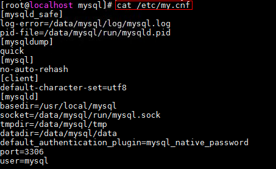

# 运行<a name="ZH-CN_TOPIC_0231470874"></a>

1.  修改配置文件。
    1.  创建my.cnf文件，其中文件路径（包括软件安装路径basedir、数据路径datadir等）根据实际情况修改。

        ```
        #vi /etc/my.cnf
        ```

        编辑my.cnf内容如下：

        ```
        [mysqld_safe]
        log-error=/data/mysql/log/mysql.log
        pid-file=/data/mysql/run/mysqld.pid
        [mysqldump]
        quick
        [mysql]
        no-auto-rehash
        [client]
        default-character-set=utf8
        [mysqld]
        basedir=/usr/local/mysql
        socket=/data/mysql/run/mysql.sock
        tmpdir=/data/mysql/tmp
        datadir=/data/mysql/data
        default_authentication_plugin=mysql_native_password
        port=3306
        user=mysql
        ```

    2.  确保my.cnf配置文件修改正确。

        ```
        #cat /etc/my.cnf
        ```

        

        > **注意：**   
        >其中basedir为软件安装路径，请根据实际情况修改。  

    3.  修改/etc/my.cnf文件的组和用户为mysql:mysql

        ```
        #chown mysql:mysql /etc/my.cnf
        ```

2.  配置环境变量。
    1.  安装完成后，将MySQL二进制文件路径到PATH。

        ```
        #echo export  PATH=$PATH:/usr/local/mysql/bin  >> /etc/profile
        ```

        > **注意：**   
        >其中PATH中的“/usr/local/mysql/bin“路径，为MySQL软件安装目录下的bin文件的绝对路径。请根据实际情况修改。  

    2.  使环境变量配置生效。

        ```
        #source /etc/profile
        ```

3.  <a name="li15634560582"></a>初始化数据库。

    > **说明：**   
    >本步骤倒数第2行中有初始密码，请注意保存，登录数据库时需要使用。  

    ```
    #mysqld --defaults-file=/etc/my.cnf --initialize
    2020-03-18T03:27:13.702385Z 0 [System] [MY-013169] [Server] /usr/local/mysql/bin/mysqld (mysqld 8.0.17) initializing of server in progress as process 34014
    2020-03-18T03:27:24.112453Z 5 [Note] [MY-010454] [Server] A temporary password is generated for root@localhost: iNat=)#V2tZu
    2020-03-18T03:27:28.576003Z 0 [System] [MY-013170] [Server] /usr/local/mysql/bin/mysqld (mysqld 8.0.17) initializing of server has completed
    ```

    查看打印信息，打印信息中包括“initializing of server has completed”表示初始化数据库完成，且打印信息中“A temporary password is generated for root@localhost: iNat=\)\#V2tZu”的“iNat=\)\#V2tZu”为初始密码。

4.  启动数据库。

    > **注意：**   
    >如果第一次启动数据库服务，以root用户启动数据库，则启动时会提示缺少mysql.log文件而导致失败。使用mysql用户启动之后，会在/data/mysql/log目录下生成mysql.log文件，再次使用root用户启动则不会报错。  

    1.  修改文件权限。

        ```
        #chmod 777 /usr/local/mysql/support-files/mysql.server
        ```

    2.  启动MySQL。

        ```
        #cp /usr/local/mysql/support-files/mysql.server /etc/init.d/mysql
        #chkconfig mysql on
        ```

        以mysql用户启动数据库。

        ```
        #su - mysql
        $service mysql start
        ```

5.  登录数据库。

    > **说明：**   
    >-   提示输入密码时，请输入[3](#li15634560582)产生的初始密码。  
    >-   如果采用官网RPM安装方式，则mysql文件在/usr/bin目录下。登录数据库的命令根据实际情况修改。  

    ```
    $/usr/local/mysql/bin/mysql -uroot -p  -S /data/mysql/run/mysql.sock
    ```

    

6.  配置数据库帐号密码。
    1.  登录数据库以后，修改通过root用户登录数据库的密码。

        ```
        mysql>alter user 'root'@'localhost' identified by "123456";
        ```

    2.  创建全域root用户（允许root从其他服务器访问）。

        ```
        mysql>create user 'root'@'%' identified by '123456';
        ```

    3.  进行授权。

        ```
        mysql>grant all privileges on *.* to 'root'@'%';
        mysql>flush privileges;
        ```

        

7.  退出数据库。

    执行**\\q**或者**exit**退出数据库。

    ```
    mysql>exit
    ```

    


