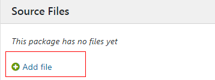

# 新增软件包

使用OBS网页端，新增一个全新软件包的操作方法如下：

1.  登录OBS界面。
2.  根据新增软件包的依赖情况，选择合适的工程，即单击“All Projects”选择对应工程，例如“openEuler:Mainline”。
3.  单击工程下任一软件包，进入该软件包的详情页面。
4.  单击“Branch package”，在弹出的确认页面单击“Accept”确认创建子工程。
5.  单击“Delete package”，删除新创建子工程中的软件包，如[图1](#fig18306181103615)所示。

    **图 1**  删除子工程中软件包  
    

    > **说明：**   
    >通过已有软件创建新工程是为了继承环境等依赖，而不需要实际的文件，所以这里需要把这些文件删除。  

6.  单击“Create Package”，在弹出的页面输入软件包名称、标题和软件包描述，然后单击“Create”创建软件包，分别如[图2](#fig6762111693811)、[图3](#fig18351153518389)所示。

    **图 2**  Create Package页面  
    

    **图 3**  创建软件包信息填写页面  
    

7.  在页面中单击“Add file”上传spec文件和需要编译的文件（在spec文件中指定），如[图4](#fig1475845284011)所示。

    **图 4**  Add file页面  
    

8.  文件上传成功后，OBS会自动开始构建RPM软件包。等待构建完成，并查看右侧状态栏的构建状态。
    -   succeed：构建成功。用户可以单击“succeeded”查看构建日志。
    -   failed：构建失败。请单击“failed”查看错误日志进行问题定位后重新构建。
    -   unresolvable：未进行构建，可能由于缺失依赖。
    -   disabled：构建被手动关闭或正在排队构建。
    -   excluded：构建被禁止，可能由于缺少spec文件或者spec文件中禁止了目标架构的编译。

