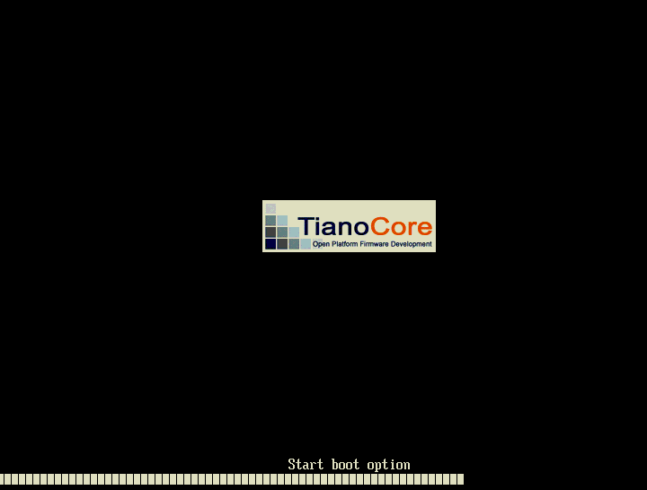
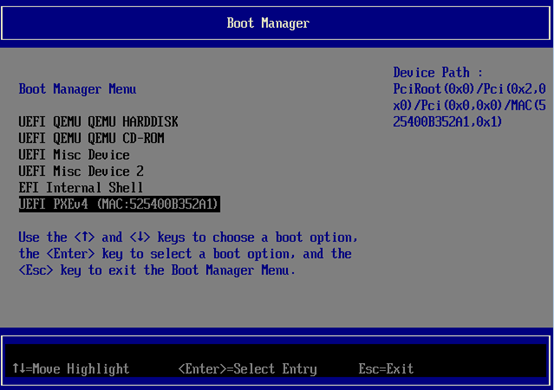

# 全自动化安装指导<a name="ZH-CN_TOPIC_0187280630"></a>

## 环境要求<a name="section624913414504"></a>

使用kickstart进行openEuler系统的全自动化安装的环境要求如下：

-   物理机/虚拟机（虚拟机创建可参考对应厂商的资料）。
-   httpd：存放kickstart文件。
-   tftp：提供vmlinuz和initrd文件。
-   dhcpd/pxe：提供DHCP服务。
-   ISO：openEuler-1.0-aarch64-dvd.iso。

## 操作步骤<a name="section9467123415317"></a>

使用kickstart进行openEuler系统的全自动化安装的操作步骤如下：

**环境准备**

1.  httpd的安装与服务启动。

    ```
    # dnf install httpd -y
    # systemctl start httpd
    # systemctl enable httpd
    ```

2.  tftp的安装与配置。

    ```
    # dnf install tftp-server -y
    # vim /etc/xinetd.d/tftp
    service tftp
    {
    socket_type = dgram
    protocol = udp
    wait = yes
    user = root
    server = /usr/sbin/in.tftpd
    server_args = -s /var/lib/tftpboot
    disable = no
    per_source = 11
    cps = 100 2
    flags = IPv4
    }
    # systemctl start tftp
    # systemctl enable tftp
    # systemctl start xinetd
    # systemctl status xinetd
    # systemctl enable xinetd
    ```

3.  <a name="zh-cn_topic_0151920754_l1692f6b9284e493683ffa2ef804bc7ca"></a>安装源的制作。

    ```
    # mount openEuler-1.0-aarch64-dvd.iso /mnt
    # cp -r /mnt/* /var/www/html/openEuler/
    ```

4.  设置和修改kickstart配置文件 openEuler-ks.cfg，参考步骤[3](#zh-cn_topic_0151920754_l1692f6b9284e493683ffa2ef804bc7ca)安装源的目录，此处选择http安装源。

    ```
    #vim  /var/www/html/ks/openEuler-ks.cfg
    ====================================
    ***以下内容根据实际需求进行修改***
    #version=DEVEL
    ignoredisk --only-use=sda
    autopart --type=lvm
    # Partition clearing information
    clearpart --none --initlabel
    # Use text mode install
    text
    # Keyboard layouts
    keyboard --vckeymap=cn --xlayouts='cn'
    # System language
    lang zh_CN.UTF-8
    #Use http installation source
    url  --url=//192.168.122.1/openEuler/
    %post
    #enable kdump
    sed  -i "s/ ro / ro crashkernel=512M,high /" /boot/efi/EFI/openEuler/grub.cfg
    %end
    ...（后面内容从略）
    ```

5.  修改pxe配置文件grub.cfg， 可参考如下内容。

    ```
    # cp -r /mnt/images/pxeboot/* /var/lib/tftpboot/
    # cp /mnt/EFI/BOOT/grubaa64.efi /var/lib/tftpboot/
    # cp /mnt/EFI/BOOT/grub.cfg /var/lib/tftpboot/
    # ls /var/lib/tftpboot/
    grubaa64.efi  grub.cfg  initrd.img  TRANS.TBL  vmlinuz
    # vim /var/lib/tftpboot/grub.cfg
    set default="1"
    
    function load_video {
      if [ x$feature_all_video_module = xy ]; then
        insmod all_video
      else
        insmod efi_gop
        insmod efi_uga
        insmod ieee1275_fb
        insmod vbe
        insmod vga
        insmod video_bochs
        insmod video_cirrus
      fi
    }
    
    load_video
    set gfxpayload=keep
    insmod gzio
    insmod part_gpt
    insmod ext2
    
    set timeout=60
    ### END /etc/grub.d/00_header ###
    
    search --no-floppy --set=root -l 'openEuler-1.0-aarch64'
    
    ### BEGIN /etc/grub.d/10_linux ###
    menuentry 'Install openEuler 1.0 with text mode' --class red --class gnu-linux --class gnu --class os {
            set root=(tftp,192.168.1.1)
            linux /vmlinuz inst.stage2=hd:LABEL=openEuler-1.0-aarch64 ro inst.text inst.geoloc=0 console=ttyAMA0 console=tty0 inst.ks=http://192.168.122.1/ks/openEuler-ks.cfg
            initrd /initrd.img
    }
    ```

6.  DHCP的配置（可以使用dnsmasq代替 ）。

    ```
    # dnf install dhcp -y
    #
    # DHCP Server Configuration file.
    #   see /usr/share/doc/dhcp-server/dhcpd.conf.example
    #   see dhcpd.conf(5) man page
    #
    # vim /etc/dhcp/dhcpd.conf
    ddns-update-style interim;
    ignore client-updates;
    filename "grubaa64.efi"; 　　 # pxelinux 启动文件位置;
    next-server 192.168.122.1;　　# (重要)TFTP Server 的IP地址;
    subnet 192.168.122.0 netmask 255.255.255.0 {
    option routers 192.168.111.1; # 网关地址
    option subnet-mask 255.255.255.0; # 子网掩码
    range dynamic-bootp 192.168.122.50 192.168.122.200; # 动态ip范围
    default-lease-time 21600;
    max-lease-time 43200;
    }
    # systemctl start dhcpd
    # systemctl enable dhcpd
    ```


**安装系统**

1.  在【Start boot option】界面按下【F2】选择从网络pxe启动，开始自动化安装。

    

    

    

2.  进入系统全自动化安装界面。
3.  确认系统安装完毕。

    


