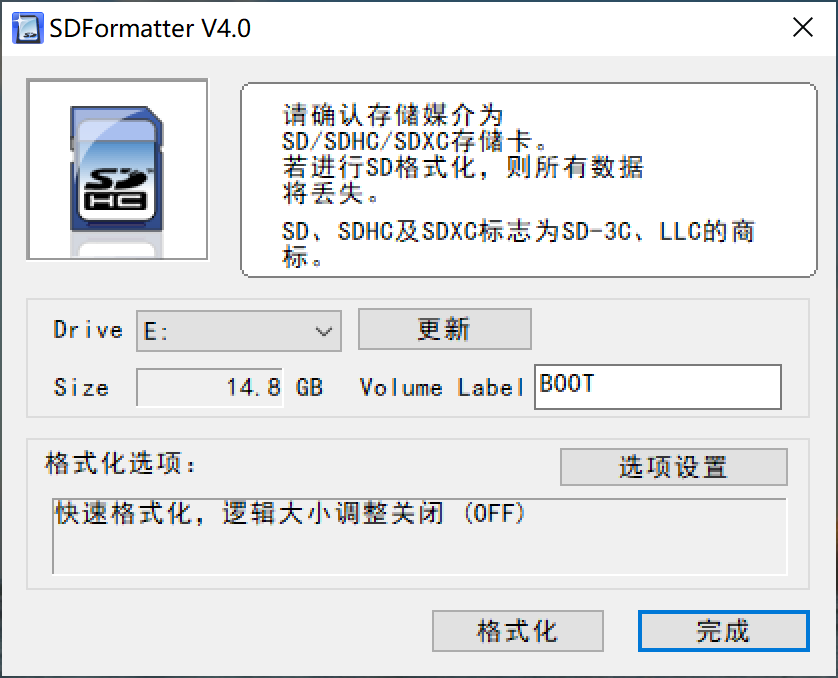

# 安装方式介绍

> **须知：**   
>-   硬件仅支持树莓派 3B/3B+/4B。  
>-   采用刷写镜像到 SD 卡方式安装。本节提供 Windows/Linux/Mac 上刷写镜像的操作方法。
<!-- TOC -->

- [安装方式介绍](#安装方式介绍)
    - [Windows 下刷写镜像](#windows-下刷写镜像)
        - [获取镜像](#获取镜像)
        - [格式化 SD 卡](#格式化-sd-卡)
        - [写入 SD 卡](#写入-sd-卡)
    - [Linux下刷写镜像](#linux下刷写镜像)
        - [获取镜像](#获取镜像-1)
        - [查看磁盘分区信息](#查看磁盘分区信息)
        - [卸载 SD 卡挂载点](#卸载-sd-卡挂载点)
        - [写入 SD 卡](#写入-sd-卡-1)
    - [Mac下刷写镜像](#mac下刷写镜像)
        - [获取镜像](#获取镜像-2)
        - [查看磁盘分区信息](#查看磁盘分区信息-1)
        - [卸载 SD 卡挂载点](#卸载-sd-卡挂载点-1)
        - [写入 SD 卡](#写入-sd-卡-2)

<!-- /TOC -->

## Windows 下刷写镜像

本节以 windows10 为例，介绍如何在 windows 环境下将镜像刷写到 SD 卡。

### 获取镜像

根据 [安装准备](#安装准备) 获取 openEuler 的树莓派版本镜像。如果获取的是压缩后的镜像，需要先将压缩文件解压得到 img 格式的镜像文件。

右键选择镜像的压缩文件 “openEuler-20.03-LTS-aarch64-raspi.img.xz”，选择提取到当前位置，待解压结束，当前目录下得到镜像文件 “openEuler-20.03-LTS-aarch64-raspi.img”。

### 格式化 SD 卡

下载应用：SDFormater，用于格式化 SD 卡。

若 SD 卡之前未安装过镜像，盘符只有一个，SDFormater 应用中选择 SD 卡对应盘符，直接格式化即可；

若 SD 卡之前安装过镜像，盘符会有多个，如下图所示，该 SD 卡对应三个盘符：E、G、H，SDFormater 应用中选择 SD 卡对应 boot 分区盘符 E，格式化即可。

### 写入 SD 卡

下载应用：Win32 Disk Imager。

右键选择“以管理员身份运行”，打开 Win32 Disk Imager，选择镜像 img 文件和待写入的 SD 卡，点击【写入/Write】。

写入完成即可。

写入成功后，SD 卡自动分区后的盘符为三个，如下图所示。

## Linux下刷写镜像

本节介绍如何在Linux环境下将镜像刷写到SD卡。

### 获取镜像

根据 [安装准备](#安装准备) 获取 openEuler 的树莓派版本镜像。如果获取的是压缩后的镜像，需要先将压缩文件解压得到 img 格式的镜像文件。

`xz -d openEuler-20.03-LTS-aarch64-raspi.img.xz`

待解压结束，当前目录下得到镜像文件 “openEuler-20.03-LTS-aarch64-raspi.img”。

### 查看磁盘分区信息

`fdisk -l`

获取 SD 卡磁盘信息，例如 SD 卡对应磁盘为 /dev/sdb。

### 卸载 SD 卡挂载点

查看当前已挂在的卷

`df -lh`

如果 SD 卡对应的分区未挂载，则该步骤跳过；如果 SD 卡对应分区已挂载，如 SD 卡对应的两个分区 /dev/sdb1 和 /dev/sdb3 已挂载，则需要卸载对应分区：

`umount /dev/sdb1`

`umount /dev/sdb3`

### 写入 SD 卡

将下载的镜像 `openEuler-20.03-LTS-aarch64-raspi.img` 刷写入 SD 卡。

`dd bs=4M if=openEuler-20.03-LTS-aarch64-raspi.img of=/dev/sdb` 

## Mac下刷写镜像

本节介绍如何在Mac环境下将镜像刷写到SD卡。

### 获取镜像

根据 [安装准备](#安装准备) 获取 openEuler 的树莓派版本镜像。如果获取的是压缩后的镜像，需要先将压缩文件解压得到 img 格式的镜像文件。

`xz -d openEuler-20.03-LTS-aarch64-raspi.img.xz`

待解压结束，当前目录下得到镜像文件 “openEuler-20.03-LTS-aarch64-raspi.img”。

### 查看磁盘分区信息

`diskutil list`

获取 SD 卡磁盘信息，例如 SD 卡对应磁盘为 /dev/disk3。

### 卸载 SD 卡挂载点

查看当前已挂在的卷

`df -lh`

如果 SD 卡对应的分区未挂载，则该步骤跳过；如果 SD 卡对应分区已挂载，如 SD 卡对应的两个分区 /dev/sdb1 和 /dev/sdb3 已挂载，则需要卸载对应分区：

`diskutil umount /dev/sdb1`

`diskutil umount /dev/sdb3`

### 写入 SD 卡

将下载的镜像 `openEuler-20.03-LTS-aarch64-raspi.img` 刷入 SD 卡。

`dd bs=4m if=openEuler-20.03-LTS-aarch64-raspi.img of=/dev/sdb`
