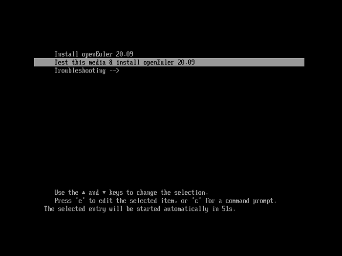
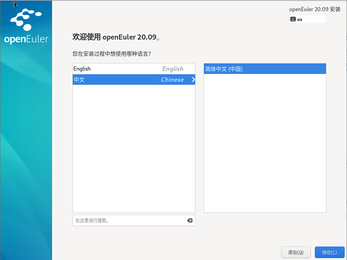
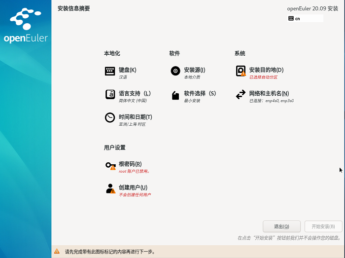
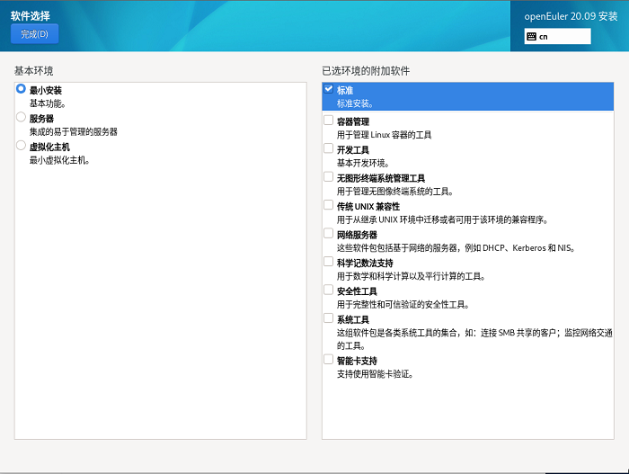
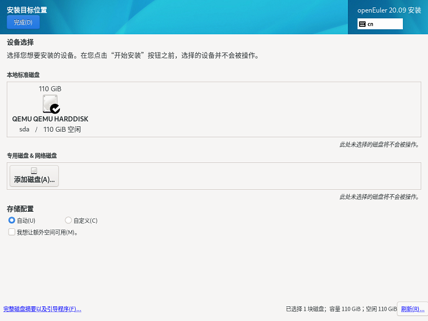
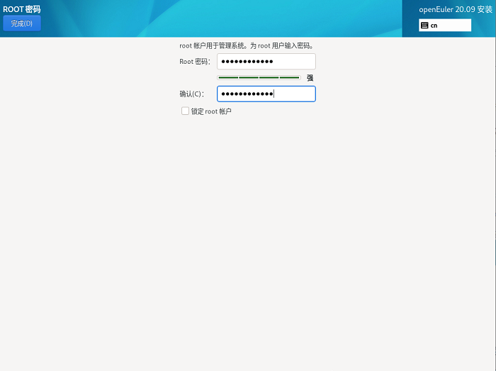
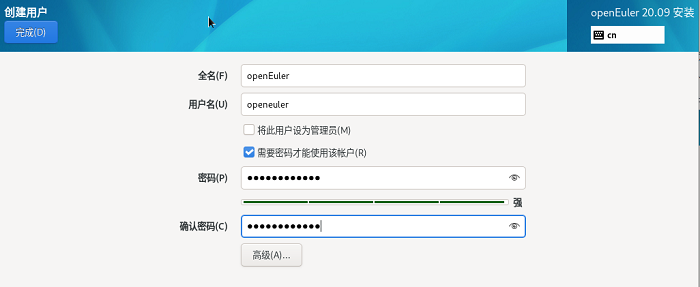
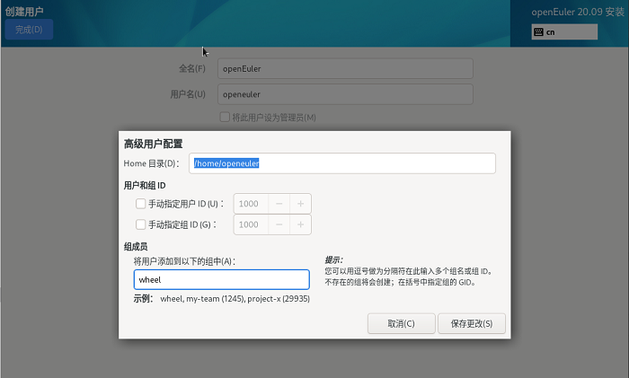
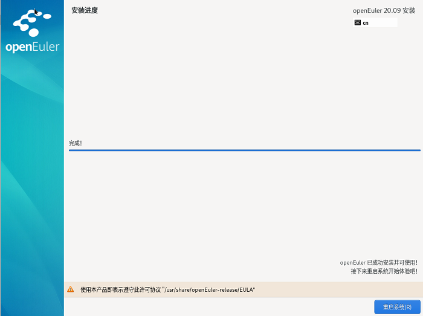

# 快速入门

本文档以TaiShan 200服务器上安装openEuler 20.09 为例，旨在指导用户快速地安装和使用openEuler操作系统，更详细的安装要求和安装方法请参考《[openEuler 20.09 安装指南](../Installation/installation.html)》。
<!-- TOC -->

- [快速入门](#快速入门)
    - [安装要求](#安装要求)
    - [获取安装源](#获取安装源)
    - [发布包完整性校验](#发布包完整性校验)
    - [启动安装](#启动安装)
    - [安装](#安装)
    - [查看系统信息](#查看系统信息)

<!-- /TOC -->

## 安装要求

-   硬件兼容支持

    支持的服务器类型如[表1](#table14948632047)所示。

    **表 1**  支持的服务器类型

    <a name="table14948632047"></a>
    <table><thead align="left"><tr id="zh-cn_topic_0229291190_row5949431547"><th class="cellrowborder" valign="top" width="26.369999999999997%" id="mcps1.2.4.1.1"><p id="zh-cn_topic_0229291190_p694923843"><a name="zh-cn_topic_0229291190_p694923843"></a><a name="zh-cn_topic_0229291190_p694923843"></a><strong id="zh-cn_topic_0229291190_b1990114912213"><a name="zh-cn_topic_0229291190_b1990114912213"></a><a name="zh-cn_topic_0229291190_b1990114912213"></a>服务器形态</strong></p>
    </th>
    <th class="cellrowborder" valign="top" width="24%" id="mcps1.2.4.1.2"><p id="zh-cn_topic_0229291190_p132705020556"><a name="zh-cn_topic_0229291190_p132705020556"></a><a name="zh-cn_topic_0229291190_p132705020556"></a><strong id="zh-cn_topic_0229291190_b18630171675"><a name="zh-cn_topic_0229291190_b18630171675"></a><a name="zh-cn_topic_0229291190_b18630171675"></a>服务器名称</strong></p>
    </th>
    <th class="cellrowborder" valign="top" width="49.63%" id="mcps1.2.4.1.3"><p id="zh-cn_topic_0229291190_p119491131848"><a name="zh-cn_topic_0229291190_p119491131848"></a><a name="zh-cn_topic_0229291190_p119491131848"></a><strong id="zh-cn_topic_0229291190_b209018491722"><a name="zh-cn_topic_0229291190_b209018491722"></a><a name="zh-cn_topic_0229291190_b209018491722"></a>服务器型号</strong></p>
    </th>
    </tr>
    </thead>
    <tbody><tr id="zh-cn_topic_0229291190_row8949153348"><td class="cellrowborder" valign="top" width="26.369999999999997%" headers="mcps1.2.4.1.1 "><p id="zh-cn_topic_0229291190_p4893192424117"><a name="zh-cn_topic_0229291190_p4893192424117"></a><a name="zh-cn_topic_0229291190_p4893192424117"></a>机架服务器</p>
    </td>
    <td class="cellrowborder" valign="top" width="24%" headers="mcps1.2.4.1.2 "><p id="zh-cn_topic_0229291190_p02706012553"><a name="zh-cn_topic_0229291190_p02706012553"></a><a name="zh-cn_topic_0229291190_p02706012553"></a>TaiShan 200</p>
    </td>
    <td class="cellrowborder" valign="top" width="49.63%" headers="mcps1.2.4.1.3 "><p id="zh-cn_topic_0229291190_p126551941225"><a name="zh-cn_topic_0229291190_p126551941225"></a><a name="zh-cn_topic_0229291190_p126551941225"></a>2280均衡型</p>
    </td>
    </tr>
    <tr id="zh-cn_topic_0229291190_row104064391909"><td class="cellrowborder" valign="top" width="26.369999999999997%" headers="mcps1.2.4.1.1 "><p id="zh-cn_topic_0229291190_p54061539609"><a name="zh-cn_topic_0229291190_p54061539609"></a><a name="zh-cn_topic_0229291190_p54061539609"></a>机架服务器</p>
    </td>
    <td class="cellrowborder" valign="top" width="24%" headers="mcps1.2.4.1.2 "><p id="zh-cn_topic_0229291190_p9937105713311"><a name="zh-cn_topic_0229291190_p9937105713311"></a><a name="zh-cn_topic_0229291190_p9937105713311"></a>FusionServer Pro 机架服务器</p>
    </td>
    <td class="cellrowborder" valign="top" width="49.63%" headers="mcps1.2.4.1.3 "><p id="zh-cn_topic_0229291190_p154063394011"><a name="zh-cn_topic_0229291190_p154063394011"></a><a name="zh-cn_topic_0229291190_p154063394011"></a>FusionServer Pro 2288H V5</p>
    <div class="note" id="zh-cn_topic_0229291190_note2046771016316"><a name="zh-cn_topic_0229291190_note2046771016316"></a><a name="zh-cn_topic_0229291190_note2046771016316"></a><span class="notetitle"> 说明： </span><div class="notebody"><p id="zh-cn_topic_0229291190_p1646710101130"><a name="zh-cn_topic_0229291190_p1646710101130"></a><a name="zh-cn_topic_0229291190_p1646710101130"></a>服务器要求配置Avago 3508 RAID控制卡和启用LOM-X722网卡。</p>
    </div></div>
    </td>
    </tr>
    </tbody>
    </table>

-   最小硬件要求

    最小硬件要求如[表2](#tff48b99c9bf24b84bb602c53229e2541)所示。

    **表 2**  最小硬件要求

    <a name="tff48b99c9bf24b84bb602c53229e2541"></a>
    <table><thead align="left"><tr id="zh-cn_topic_0229291228_r36f08b63edea4973a8228200caa2a50b"><th class="cellrowborder" valign="top" width="11.19111911191119%" id="mcps1.2.4.1.1"><p id="zh-cn_topic_0229291228_aef3575d97cdf4dcfb65f8d0c8d2d4a76"><a name="zh-cn_topic_0229291228_aef3575d97cdf4dcfb65f8d0c8d2d4a76"></a><a name="zh-cn_topic_0229291228_aef3575d97cdf4dcfb65f8d0c8d2d4a76"></a><strong id="zh-cn_topic_0229291228_abf63bde6a66a4ce5b21d81948fcafe36"><a name="zh-cn_topic_0229291228_abf63bde6a66a4ce5b21d81948fcafe36"></a><a name="zh-cn_topic_0229291228_abf63bde6a66a4ce5b21d81948fcafe36"></a>部件名称</strong></p>
    </th>
    <th class="cellrowborder" valign="top" width="40.06400640064006%" id="mcps1.2.4.1.2"><p id="zh-cn_topic_0229291228_a919d3bb266c8432fb33c51fa8f3a4fc3"><a name="zh-cn_topic_0229291228_a919d3bb266c8432fb33c51fa8f3a4fc3"></a><a name="zh-cn_topic_0229291228_a919d3bb266c8432fb33c51fa8f3a4fc3"></a><strong id="zh-cn_topic_0229291228_a9386cf027c1e47d99651159bb62130e7"><a name="zh-cn_topic_0229291228_a9386cf027c1e47d99651159bb62130e7"></a><a name="zh-cn_topic_0229291228_a9386cf027c1e47d99651159bb62130e7"></a>最小硬件要求</strong></p>
    </th>
    <th class="cellrowborder" valign="top" width="48.74487448744874%" id="mcps1.2.4.1.3"><p id="zh-cn_topic_0229291228_a3ac7cf4867974c4990ee6deab716db5f"><a name="zh-cn_topic_0229291228_a3ac7cf4867974c4990ee6deab716db5f"></a><a name="zh-cn_topic_0229291228_a3ac7cf4867974c4990ee6deab716db5f"></a><strong id="zh-cn_topic_0229291228_a0206841e981640cf833dc2556a7def50"><a name="zh-cn_topic_0229291228_a0206841e981640cf833dc2556a7def50"></a><a name="zh-cn_topic_0229291228_a0206841e981640cf833dc2556a7def50"></a>说明</strong></p>
    </th>
    </tr>
    </thead>
    <tbody><tr id="zh-cn_topic_0229291228_r1a3ceb0cc79241c6ba8c5fb800c274e2"><td class="cellrowborder" valign="top" width="11.19111911191119%" headers="mcps1.2.4.1.1 "><p id="zh-cn_topic_0229291228_af37d7ef138ee45eca00898e0d34a03f4"><a name="zh-cn_topic_0229291228_af37d7ef138ee45eca00898e0d34a03f4"></a><a name="zh-cn_topic_0229291228_af37d7ef138ee45eca00898e0d34a03f4"></a>架构</p>
    </td>
    <td class="cellrowborder" valign="top" width="40.06400640064006%" headers="mcps1.2.4.1.2 "><a name="zh-cn_topic_0229291228_ul262164044016"></a><a name="zh-cn_topic_0229291228_ul262164044016"></a><ul id="zh-cn_topic_0229291228_ul262164044016"><li>AArch64</li><li>x86_64</li></ul>
    </td>
    <td class="cellrowborder" valign="top" width="48.74487448744874%" headers="mcps1.2.4.1.3 "><a name="zh-cn_topic_0229291228_ul1830173916388"></a><a name="zh-cn_topic_0229291228_ul1830173916388"></a><ul id="zh-cn_topic_0229291228_ul1830173916388"><li>支持Arm的64位架构。</li><li>支持Intel的x86 64位架构。</li></ul>
    </td>
    </tr>
    <tr id="zh-cn_topic_0229291228_ra68eff5c33a84bb2be6672a48a643d26"><td class="cellrowborder" valign="top" width="11.19111911191119%" headers="mcps1.2.4.1.1 "><p id="zh-cn_topic_0229291228_ac0a50d2069ab444cafff180647772df4"><a name="zh-cn_topic_0229291228_ac0a50d2069ab444cafff180647772df4"></a><a name="zh-cn_topic_0229291228_ac0a50d2069ab444cafff180647772df4"></a>CPU</p>
    </td>
    <td class="cellrowborder" valign="top" width="40.06400640064006%" headers="mcps1.2.4.1.2 "><a name="zh-cn_topic_0229291228_ul97131912175915"></a><a name="zh-cn_topic_0229291228_ul97131912175915"></a><ul id="zh-cn_topic_0229291228_ul97131912175915"><li>华为鲲鹏920系列CPU</li><li>Intel<sup id="zh-cn_topic_0229291228_sup487664501416"><a name="zh-cn_topic_0229291228_sup487664501416"></a><a name="zh-cn_topic_0229291228_sup487664501416"></a>&reg;</sup> Xeon<sup id="zh-cn_topic_0229291228_sup10571950171416"><a name="zh-cn_topic_0229291228_sup10571950171416"></a><a name="zh-cn_topic_0229291228_sup10571950171416"></a>&reg;</sup>处理器</li></ul>
    </td>
    <td class="cellrowborder" valign="top" width="48.74487448744874%" headers="mcps1.2.4.1.3 "><p id="zh-cn_topic_0229291228_a2601e9eece5f4c7bb02881c9ac647a61"><a name="zh-cn_topic_0229291228_a2601e9eece5f4c7bb02881c9ac647a61"></a><a name="zh-cn_topic_0229291228_a2601e9eece5f4c7bb02881c9ac647a61"></a>-</p>
    </td>
    </tr>
    <tr id="zh-cn_topic_0229291228_rf2a5d43b74894a0882b7c17bdfeb697f"><td class="cellrowborder" valign="top" width="11.19111911191119%" headers="mcps1.2.4.1.1 "><p id="zh-cn_topic_0229291228_ad00611ec129a41a9841fb579eece7804"><a name="zh-cn_topic_0229291228_ad00611ec129a41a9841fb579eece7804"></a><a name="zh-cn_topic_0229291228_ad00611ec129a41a9841fb579eece7804"></a>内存</p>
    </td>
    <td class="cellrowborder" valign="top" width="40.06400640064006%" headers="mcps1.2.4.1.2 "><p id="zh-cn_topic_0229291228_a94efe642b8694e5a85747e123b951efc"><a name="zh-cn_topic_0229291228_a94efe642b8694e5a85747e123b951efc"></a><a name="zh-cn_topic_0229291228_a94efe642b8694e5a85747e123b951efc"></a>不小于4GB（为了获得更好的应用体验，建议不小于8GB）</p>
    </td>
    <td class="cellrowborder" valign="top" width="48.74487448744874%" headers="mcps1.2.4.1.3 "><p id="zh-cn_topic_0229291228_abfb44d28dca741f68df94e4e276d2410"><a name="zh-cn_topic_0229291228_abfb44d28dca741f68df94e4e276d2410"></a><a name="zh-cn_topic_0229291228_abfb44d28dca741f68df94e4e276d2410"></a>-</p>
    </td>
    </tr>
    <tr id="zh-cn_topic_0229291228_rd2c1ebd93ea64e85a5f3fc88dc5ba456"><td class="cellrowborder" valign="top" width="11.19111911191119%" headers="mcps1.2.4.1.1 "><p id="zh-cn_topic_0229291228_afd36954546334c1681b5a391bbc386ae"><a name="zh-cn_topic_0229291228_afd36954546334c1681b5a391bbc386ae"></a><a name="zh-cn_topic_0229291228_afd36954546334c1681b5a391bbc386ae"></a>硬盘</p>
    </td>
    <td class="cellrowborder" valign="top" width="40.06400640064006%" headers="mcps1.2.4.1.2 "><p id="zh-cn_topic_0229291228_p1224172312719"><a name="zh-cn_topic_0229291228_p1224172312719"></a><a name="zh-cn_topic_0229291228_p1224172312719"></a>为了获得更好的应用体验，建议不小于120GB）</p>
    </td>
    <td class="cellrowborder" valign="top" width="48.74487448744874%" headers="mcps1.2.4.1.3 "><p id="zh-cn_topic_0229291228_acc0affdd82e34f32966171e21855ef40"><a name="zh-cn_topic_0229291228_acc0affdd82e34f32966171e21855ef40"></a><a name="zh-cn_topic_0229291228_acc0affdd82e34f32966171e21855ef40"></a>支持IDE、SATA、SAS等接口的硬盘。</p>
    </td>
    </tr>
    </tbody>
    </table>


## 获取安装源

请按以下步骤获取openEuler的发布包和校验文件：

>  **说明：**   
> AArch64架构的发布包支持UEFI模式，x86\_64架构的发布包支持UEFI模式和Legacy模式。

1.  登录[openEuler社区](https://openeuler.org)网站。
2.  单击“下载”。
3.  单击“获取ISO：”后面的“Link”，显示版本列表。
4.  单击“openEuler-20.09”，进入openEuler 20.09版本下载列表。
5.  单击“ISO”，进入ISO下载列表。
    -   aarch64：AArch64架构的ISO。
    -   x86\_64：x86\_64架构的ISO。
    -   source：openEuler源码ISO。

6.  根据实际待安装环境的架构选择需要下载的openEuler的发布包和校验文件。
    -   若为AArch64架构。
        1.  单击“aarch64”。
        2.  单击“openEuler-20.09-aarch64-dvd.iso”，将openEuler发布包下载到本地。
        3.  单击“openEuler-20.09-aarch64-dvd.iso.sha256sum”，将openEuler校验文件下载到本地。

    -   若为x86\_64架构。
        1.  单击“x86\_64”。
        2.  单击“openEuler-20.09-x86\_64-dvd.iso”，将openEuler发布包下载到本地。
        3.  单击“openEuler-20.09-x86\_64-dvd.iso.sha256sum”，将openEuler校验文件下载到本地。


## 发布包完整性校验

为了防止软件包在传输过程中由于网络原因或者存储设备原因出现下载不完整的问题，在获取到软件包后，可按以下步骤将获取到的openEuler的软件包进行完整性校验。

1.  获取校验文件中的校验值。执行命令如下：

    ```
    $ cat openEuler-20.09-aarch64-dvd.iso.sha256sum 
    ```

2.  计算文件的sha256校验值。执行命令如下：

    ```
    $ sha256sum openEuler-20.09-aarch64-dvd.iso
    ```

    命令执行完成后，输出校验值。

3.  对比步骤1和步骤2计算的校验值是否一致。

    如果校验值一致说明iso文件完整性没有破坏，如果校验值不一致则可以确认文件完整性已被破坏，需要重新获取。


## 启动安装

1.  登录服务器iBMC Web界面。具体方法请参考《[TaiShan 200 服务器 用户指南 \(型号 2280\) ](https://support.huawei.com/enterprise/zh/doc/EDOC1100088652)》。
2.  在上方标题栏中，选择“配置”，在左侧导航树中选择“系统启动项”，显示“系统启动项”界面。

    将“引导介质有效期”和“引导介质”分别设置为“单次有效”和“光驱”，并单击“保存”以保存配置。如[图1](#fig1011938131018)所示。

    **图 1**  设置系统启动项<a name="fig1011938131018"></a>  
    

3.  在上方标题栏中，选择“远程控制”，在左侧导航树中选择“远程控制”，显示“远程控制”界面。

    根据实际情况选择一个集成远程控制台以进入远程虚拟控制台，如选择“Java集成远程控制台\(共享\)”。

4.  在虚拟界面工具栏中，单击虚拟光驱工具如下图所示。

    **图 2**  光驱图标<a name="zh-cn_topic_0229291223_zh-cn_topic_0151920806_f6ff7658b349942ea87f4521c0256c32e"></a>  
    

    弹出镜像对话框，如下图所示。

    **图 3**  镜像对话框<a name="zh-cn_topic_0229291223_zh-cn_topic_0151920806_fb74fb37f86cd423aacf34bddedd6841a"></a>  
    

5.  在镜像对话框中，选择“镜像文件”， 并单击“浏览”。弹出“打开”对话框。
6.  选择镜像文件，单击“打开”。然后在镜像对话框中，单击“连接”。当“连接”显示为“断开”后，表示虚拟光驱已连接到服务器。
7.  在工具栏中，单击重启工具重启设备，如下图所示。

    **图 4**  重启图标<a name="zh-cn_topic_0229291223_zh-cn_topic_0151920806_f0d1f4f5f96de47b48c64b3535b2b60d1"></a>  
    

8.  设备重启后进入到openEuler操作系统安装引导界面，如[图5](#fig1648754873314)所示。

    > **说明：**   
    >-   如果60秒内未按任何键，系统将从默认选项“Test this media & install openEuler 20.09”自动进入安装界面。  
    >-   安装物理机时，如果使用键盘上下键无法选择启动选项，按“Enter”键无响应，可以单击BMC界面上的鼠标控制图标“”，设置“键鼠复位”。  

    **图 5**  安装引导界面<a name="fig1648754873314"></a>  
    

9.  在安装引导界面，按“Enter”，进入默认选项“Test this media & install openEuler 20.09”的图形化安装界面。

## 安装

进入图形化安装界面后，按如下步骤进行安装。

1.  设置安装语言，默认为英语，用户可根据实际情况进行调整，如[图6](#fig874344811484)所示，选择“中文”。

    **图 6**  选择语言<a name="fig874344811484"></a>  
    

2. 在安装概览界面，根据实际情况设置各配置项。

    -   配置项有告警符号的，表示用户必须完成该选项配置后，告警符号消失，才能进行下一步操作。
    -   配置项无告警符号的，表示该配置项已有默认配置。
    -   所有配置项均无告警符号时用户才能单击“开始安装”进行系统安装。

    **图 7**  安装概览<a name="fig24261457656"></a>  
    

    1.  选择“软件选择”，设置“软件选择”配置项。

        用户需要根据实际的业务需求，在左侧选择一个“最小安装”，在右侧选择安装环境的附加选项，如[图8](#fig1133717611109)所示。

        **图 8**  软件选择<a name="fig1133717611109"></a>  
        

        > **说明：**   
        >-   在最小安装的环境下，并非安装源中所有的包都会安装。如果用户需要使用的包未安装，可将安装源挂载到本地制作repo源，通过DNF工具单独安装。  
        >-   选择“虚拟化主机”时会默认安装虚拟化组件qemu、libvirt、edk2，且可在附件选项处选择是否安装ovs等组件。  

        设置完成后，请单击左上角“完成”返回“安装概览”页面。

    2. 选择“安装目的地”，设置“安装目的地”配置项。

        在安装位置页面中，您可以选择计算机中的本地可用存储设备。

        > **须知：**   
        >在选择您需要安装的设备时，建议不要选择NVMe SSD存储介质作为操作系统的安装磁盘。  
        
        您还需要进行存储配置以便对系统分区。您可以手动配置分区，也可以选择让安装程序自动分区。如果是在未使用过的存储设备中执行全新安装，或者不需要保留该存储设备中任何数据，建议选择“自动”进行自动分区。如[图9](#fig153381468101)所示。

        **图 9**  安装目标位置<a name="fig153381468101"></a>  
        

        > **说明：**   
        >-   在进行分区时，出于系统性能和安全的考虑，建议您划分如下单独分区：/boot、/var、/var/log 、/var/log/audit、/home、/tmp。  
        >-   系统如果配置了swap分区，当系统的物理内存不够用时，会使用swap分区。虽然 swap分区可以增大物理内存大小的限制，但是如果由于内存不足使用到swap分区，会增加系统的响应时间，性能变差。因此在物理内存充足或者性能敏感的系统中，不建议配置swap分区。  
        >-   如果需要拆分逻辑卷组则需要选择“自定义”进行手动分区，并在“手动分区”界面单击“卷组”区域中的“修改”按钮重新配置卷组。  

        设置完成后，请单击左上角“完成”返回“安装概览”页面。

    3. 选择“根密码”，设置“根密码”配置项。

        在“ROOT密码”页面中，如[图10](#zh-cn_topic_0186390266_zh-cn_topic_0122145909_fig1323165793018)所示，根据[密码复杂度](#密码复杂度)输入密码并再次输入密码进行确认。

        > **说明：**   
        >
        >- root帐户是用来执行关键系统管理任务，不建议您在日常工作及系统访问时使用root帐户。
        >
        >- 在“ROOT密码”界面若选择“锁定root帐户”则root帐户将禁用。  

        **密码复杂度** <a name = "密码复杂度"></a>

        用户设置的root用户密码或新创建用户的密码均需要满足密码复杂度要求，否则会导致密码设置或用户创建失败。设置密码的复杂度的要求如下：

        1. 口令长度至少8个字符。

        2. 口令至少包含大写字母、小写字母、数字和特殊字符中的任意3种。

        3. 口令不能和账号一样。

        4. 口令不能使用字典词汇。

            > **说明：**   
            > 在已装好的openEuler环境中，可以通过`cracklib-unpacker /usr/share/cracklib/pw_dict > dictionary.txt`命令导出字典库文件dictionary.txt，用户可以查询密码是否在该字典中。

        **图 10**  root密码<a name="zh-cn_topic_0186390266_zh-cn_topic_0122145909_fig1323165793018"></a>  
        

        设置完成后，单击左上角的“完成”返回“安装概览”页面。

    4. 选择“创建用户”，设置“创建用户”配置项。

        在创建用户的界面如[图11](#zh-cn_topic_0186390266_zh-cn_topic_0122145909_fig1237715313319)所示。输入用户名，并设置密码，其中密码复杂度要求与root密码复杂度要求一致。另外您还可以通过“高级”选项设置用户主目录、用户组等，如[图12](#zh-cn_topic_0186390266_zh-cn_topic_0122145909_fig128716531312)所示。

        **图 11**  创建用户<a name="zh-cn_topic_0186390266_zh-cn_topic_0122145909_fig1237715313319"></a>  
        

        **图 12**  高级用户配置<a name="zh-cn_topic_0186390266_zh-cn_topic_0122145909_fig128716531312"></a>  
        

        完成设置后，单击左上角的“完成”返回“安装概览”页面。

    5. 设置其他配置项，其他配置项可以使用默认配置。

3.  单击“开始安装”进行系统安装，如[图13](#fig1717019357392)所示。

    **图 13**  开始安装<a name="fig1717019357392"></a>  
    

6.  安装完成后重启系统。

    openEuler完成安装，如[图14](#zh-cn_topic_0186390267_zh-cn_topic_0122145917_fig1429512116338)所示。单击“重启”后，系统将重新启动。

    **图 14**  完成安装<a name="zh-cn_topic_0186390267_zh-cn_topic_0122145917_fig1429512116338"></a>  
    


## 查看系统信息

系统安装完成并重启后直接进入系统命令行登录界面，输入安装过程中设置的用户和密码，进入openEuler操作系统，查看如下系统信息。若需要进行系统管理和配置操作，请参考《[管理员指南](../Administration/administration.html)》。

-   查看系统信息，命令如下：

    ```
    cat /etc/os-release
    ```

    例如，命令和输出如下：

    ```
    $ cat /etc/os-release
    NAME="openEuler"
    VERSION="20.09"
    ID="openEuler"
    VERSION_ID="20.09"
    PRETTY_NAME="openEuler 20.09"
    ANSI_COLOR="0;31"
    ```

-   查看系统相关的资源信息。

    查看CPU信息，命令如下：

    ```
    lscpu
    ```

    查看内存信息，命令如下：

    ```
    free
    ```

    查看磁盘信息，命令如下：

    ```
    fdisk -l
    ```

-   查看IP地址，命令如下：

    ```
    ip addr
    ```


