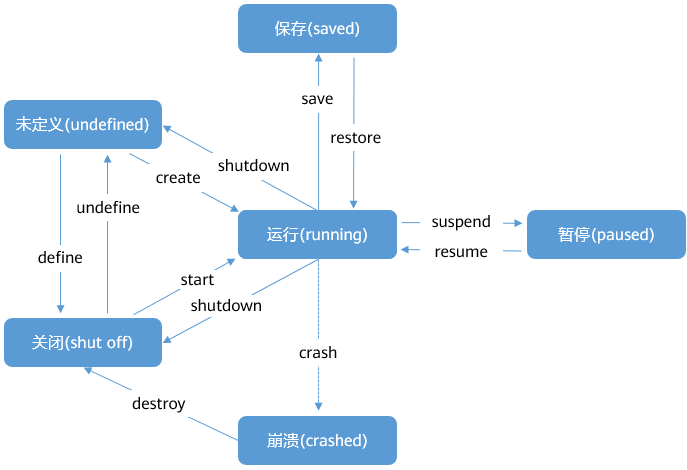

# 总体介绍

## 概述

为了更好地利用硬件资源，降低成本，用户需要合理地管理虚拟机。本节介绍虚拟机生命周期过程中的基本操作，包括虚拟机创建、使用、删除等，指导用户更好地管理虚拟机。

## 虚拟机状态

虚拟机主要有如下几种状态：

-   未定义（undefined）：虚拟机未定义或未创建，即libvirt认为该虚拟机不存在。
-   关闭状态（shut off）：虚拟机已经被定义但未运行，或者虚拟机被终止。
-   运行中（running）：虚拟机处于运行状态。
-   暂停（paused）：虚拟机运行被挂起，其运行状态被临时保存在内存中，可以恢复到运行状态。
-   保存（saved）：与暂停（paused）状态类似，其运行状态被保存在持久性存储介质中，可以恢复到运行状态。
-   崩溃（crashed）：通常是由于内部错误导致虚拟机崩溃，不可恢复到运行状态。

## 状态转换

虚拟机不同状态之间可以相关转换，但必须满足一定规则。虚拟机不同状态之间的转换常用规则如[图1](#fig671014583483)所示。

**图 1**  状态转换图  

## 虚拟机标识

在Libvirt中，完成创建的虚拟机实例称做一个“domain”，其描述了虚拟机的CPU、内存、网络设备、存储设备等各种资源的配置信息。在同一个主机上，每个domain具有唯一标识，通过虚拟机名称Name、UUID、Id表示，对应含义请参见[表1](#table84397266483)。在虚拟机生命周期期间，可以通过虚拟机标识对特定虚拟机进行操作。

**表 1**  domain标识说明

<table><thead align="left"><tr id="row194391726114819"><th class="cellrowborder" valign="top" width="24.57%" id="mcps1.2.3.1.1">
标识

</th>
<th class="cellrowborder" valign="top" width="75.42999999999999%" id="mcps1.2.3.1.2">
含义

</th>
</tr>
</thead>
<tbody><tr id="row143972684815"><td class="cellrowborder" valign="top" width="24.57%" headers="mcps1.2.3.1.1 ">
Name

</td>
<td class="cellrowborder" valign="top" width="75.42999999999999%" headers="mcps1.2.3.1.2 ">
虚拟机名称

</td>
</tr>
<tr id="row1644092654815"><td class="cellrowborder" valign="top" width="24.57%" headers="mcps1.2.3.1.1 ">
UUID

</td>
<td class="cellrowborder" valign="top" width="75.42999999999999%" headers="mcps1.2.3.1.2 ">
通用唯一识别码

</td>
</tr>
<tr id="row12440626154811"><td class="cellrowborder" valign="top" width="24.57%" headers="mcps1.2.3.1.1 ">
Id

</td>
<td class="cellrowborder" valign="top" width="75.42999999999999%" headers="mcps1.2.3.1.2 ">
虚拟机运行标识

 说明： 

关闭状态的虚拟机无此标识。

</td>
</tr>
</tbody>
</table>

> **说明：**   
>可通过virsh命令查询虚拟机Id和UUID，操作方法请参见[查询虚拟机信息](查询虚拟机信息.md)章节内容。  

