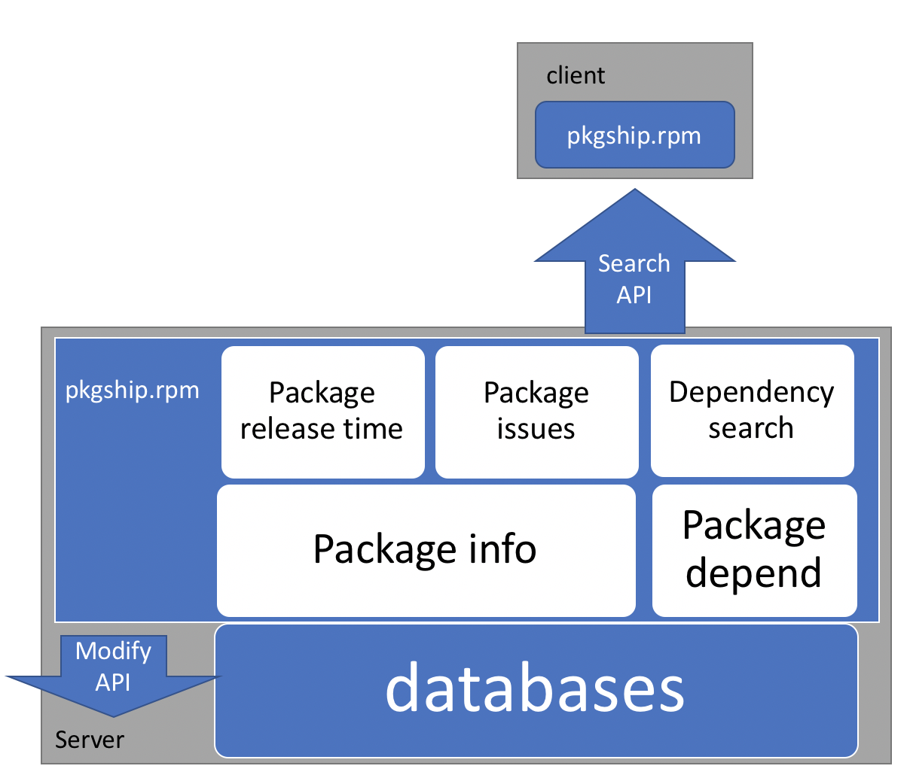

pkgship
===

# 介绍
pkgship是一款管理OS软件包依赖关系，提供依赖和被依赖关系完整图谱的查询工具，pkgship提供软件包依赖查询、生命周期管理、补丁查询等功能。

1. 软件包依赖查询：方便社区人员在软件包引入、更新和删除的时候了解软件的影响范围。
2. 生命周期管理：跟踪上游软件包发布状态，方便维护人员了解当前软件状态，及时升级到合理的版本。
3. 补丁查询：方便社区人员了解openEuler软件包的补丁情况以及提取补丁内容，详细内容请参见[patch-tracking](https://gitee.com/lss410313/docs/blob/master/content/zh/docs/userguide/patch-tracking.md)。

# 架构

系统采用flask-restful开发，使用SQLAlchemy ORM查询框架。



# 软件下载

* Repo源挂载正式发布地址：<https://repo.openeuler.org/>
* 源码获取地址：<https://gitee.com/openeuler/openEuler-Advisor/tree/master/packageship>
* rpm包beta版本获取地址：<https://117.78.1.88/project/show/openEuler:Mainline>

# 安装工具
工具安装可通过以下两种方式中的任意一种实现。

* 方法一，通过dnf挂载repo源实现。  
  先使用dnf挂载pkgship软件在所在repo源（具体方法可参考[应用开发指南](https://openeuler.org/zh/docs/20.03_LTS/docs/ApplicationDev/%E5%BC%80%E5%8F%91%E7%8E%AF%E5%A2%83%E5%87%86%E5%A4%87.html)），然后执行如下指令下载以及安装pkgship及其依赖。

    ```bash
    dnf install pkgship
    ```

* 方法二，通过安装rpm包实现。  
  先下载pkgship的rpm包，然后执行如下命令进行安装（其中“x.x-x”表示版本号，请用实际情况代替）。

    ```bash
    rpm -ivh pkgship-x.x-x.oe1.noarch.rpm
    ```

    或者

    ```bash
    dnf install pkgship-x.x-x.oe1.noarch.rpm
    ```

# 配置参数

1. 在配置文件中对相应参数进行配置，系统的默认配置文件存放在 /etc/pkgship/packge.ini，请根据实际情况进行配置更改。

    ```basn
    vim /etc/pkgship/package.ini
    ```

    ```ini
    [系统配置]

    ; 初始化数据库时导入的yaml文件存放位置，该yaml中记录导入的sqlite文件位置
    init_conf_path=/etc/pkgship/conf.yaml

    ; 存放成功导入的sqlite文件的地址
    data_base_path=/var/run/pkgship_dbs

    ; 写接口
    write_port=8080

    ; 读接口
    query_port=8090

    ; 写权限访问ip
    write_ip_addr=127.0.0.1

    ; 读权限访问ip
    query_ip_addr=127.0.0.1
    ; 远程服务的地址，命令行可以直接调用远程服务来完成数据请求, 只需在每个命令行后加 --remote参数
    remote_host=https://api.openeuler.org/pkgmanage

    [LOG]

    ; 日志存放路径
    log_path=/var/log/pkgship/

    ; 打印日志级别，支持如下：
    ; INFO DEBUG WARNING ERROR CRITICAL
    log_level=INFO

    ; 日志名称
    log_name=log_info.log

    [UWSGI服务配置]
    ; uwsgi 日志路径
    daemonize=/var/log/uwsgi.log
    ; 前后端传输数据大小
    buffer-size=65536
    ; HTTP Connection time
    http-timeout=600
    ; Server response time
    harakiri=600

    ```

2. 创建初始化数据库的yaml配置文件：
    conf.yaml 文件默认存放在 /etc/pkgship/ 路径下，pkgship会通过该配置读取要建立的数据库名称以及需要导入的sqlite文件。conf.yaml 示例如下所示。

    ```yaml
    - dbname:openEuler-20.03-LTS
     src_db_file: /etc/pkgship/src.sqlite
     bin_db_file: /etc/pkgship/bin.sqlite
     status:enable
     priority:1
    ```

> 如需更改存放路径，请更改package.ini下的 init_conf_path 选项

# 服务启动和停止

pkgship使用uWSGI web服务器,启动和停止命令如下所示。

```bash
pkgshipd start

pkgshipd stop
```

# 工具使用

1. 数据库初始化。  
   > 使用场景：服务启动后，为了能查询对应的数据库（比如mainline， openEuler-LTS-20.03）中的包信息及包依赖关系，需要将这些数据库通过createrepo生成的sqlite（分为源码库和二进制库）导入进服务内。

    ```bash
    pkgship init
    ```

2. 单包查询。

    查询源码包(sourceName)在数据库中的信息。
    > 使用场景：用户可查询具体源码包在所有数据库中信息；当命令后带配置参数[-db]时，可查询源码包在具体指定数据库中信息。  

    ```bash
    pkgship single sourceName [-db dbName]
    ```

    > -db dbName 指定具体的数据库名称

3. 所有包查询。

    查询数据库下包含的所有包的信息。
    > 使用场景：用户可查询所有数据库下包含的所有软件包信息；当命令后带配置参数[-db]时，可查询指定数据库下的所有包信息。

    ```bash
    pkgship list [-db dbName]
    ```

    > -db dbName 指定具体的数据库名称
4. 安装依赖查询。

    查询二进制包(binaryName)的安装依赖。
    > 使用场景：用户需要安装某个二进制包A时，需要将该二进制包A的安装依赖B，及B的安装依赖C等等，直至所有的安装依赖全部安装到系统才能成功安装二进制包A。因此，在用户安装二进制包A之前，可能会需要查询二进制包A的所有安装依赖。该命令提供了此功能，允许用户根据平台默认的优先级在多个数据库之间进行查询；同时也支持用户自定义数据库查询优先级。

    ```bash
    pkgship installdep binaryName [-dbs dbName1 dbName2...]
    ```

   > -dbs dbName1 dbName2... 具体指定查询数据库的顺序优先级；dbName为具体的数据库名称

5. 编译依赖查询。

    查询源码包(sourceName)的所有编译依赖。
    > 使用场景：用户要编译某个源码包A的时候，需要安装源码包A的编译依赖B, 要成功安装编译依赖B需要获取B的所有安装依赖。因此，在用户编译源码包A之前，可能会需要查询源码包的编译依赖以及这些编译依赖的所有安装依赖。该命令提供了此功能，允许用户根据平台默认的优先级在多个数据库之间进行查询;同时也支持用户自定义数据库查询优先级。

    ```bash
    pkgship builddep sourceName [-dbs dbName1 dbName2...]
    ```

   > -dbs dbName1 dbName2... 具体指定查询数据库的顺序优先级；dbName为具体的数据库名称

6. 自编译自安装依赖查询。

    查询指定二进制包(binaryName)或源码包(sourceName )的安装及编译依赖，其中[pkgName]为查询的二进制包或者源码包的名称。当查询二进制包时，可以查询到该二进制包的所有安装依赖以及该二进制包对应的源码包的编译依赖，及这些编译依赖的所有安装依赖；当查询源码包时，可以查询该源码包的编译依赖，及这些编译依赖的所有安装依赖，并且查询该源码包生成的所有二进制包的所有安装依赖。

    同时，配合对应参数使用，该命令也支持查询软件包的自编译依赖查询，和包含子包的依赖查询

    > 使用场景：如果开发者想在现有的版本库的基础上引入新的软件包，应同时引入该软件包的所有编译、安装依赖。该命令提供开发者一个同时查询这两种依赖关系的功能，能让开发者知晓该软件包会引入哪些其他的包，该命令支持查询二进制包和源码包。

    ```bash
     pkgship selfbuild [pkgName]
    ```

    > -dbs dbName1 dbName2... 指定数据库优先级,dbName为具体的数据库名称

     ``` bash
     示例:pkgship selfbuild pkgName -dbs dbName1 dbName2 
     ```

    > -t source/binary 指定查询包名pkgnName为二进制包还是源码包，不加-t时，默认为二进制包
    >-s 增加该参数表示查询软件包的所有安装依赖和所有编译依赖（即编译依赖的源码包的编译依赖），以及所有编译依赖的安装依赖。其中-s参数后面的0表示不查询自编译依赖，1表示查询自编译依赖，默认为0，可以指定1。如果不增加-s参数表示只查询软件包的所有安装依赖和一层编译依赖，以及一层编译依赖的所有安装依赖。

     ```bash
     查询自编译示例:pkgship selfbuild sourceName -t source -s 1
     ```

    > -w 增加该参数表示引入某个二进制包的时候，查询结果会显示出该二进制包对应的源码包以及该源码包生成的所有二进制包。其中-w参数后面的0表示不查询对应子包，1表示查询对应子包，默认为0，可以指定1。如果不增加-w参数表示引入某个二进制包的时候，查询结果只显示对应的源码包。

     ```bash
     查询子包示例:pkgship selfbuild binaryName -w 1
     ```

7. 被依赖查询。
    查询源码包(sourceName)在某数据库(dbName)中被哪些包所依赖。
    > 使用场景：针对软件源码包A，在升级或删除的情况下会影响哪些软件包，可通过该命令查询。该命令会显示源码包A生成的所有二进制包被哪些源码包（比如B）编译依赖，被哪些二进制包（比如C1）安装依赖；以及B生成的二进制包及C1被哪些源码包（比如D）编译依赖，被哪些二进制包（比如E1）安装依赖，以此类推，遍历这些二进制包的被依赖。 当命令后不带配置参数[-w 1] 时，查询结果默认不包含对应二进制包的子包；当命令后带配置参数[-w 1] 时，不仅会查询二进制包C1的被依赖关系，还会进一步去查询C1对应的源码包C生成的其他二进制包（比如：C2,C3）的被依赖关系。

    ```bash
     pkgship bedepend sourceName dbName [-w 1]
    ```

    > -w 进一步查询受影响的二进制包对应源码包生成的其他二进制包的被依赖关系。

8. 包信息记录修改。

    ```bash
    pkgship updatepkg sourceName db [-m] [-l]
    ```

    > -m 表示变更数据库中(dbName)源码包(sourceName)的maintainer为Newmaintainer

    变更数据库中(dbName)源码包(sourceName)的maintainer为Newmaintainer使用示例：  

    ```bash
     pkgship updatepkg sourceName db dbName -m Newmaintainer
    ```

    > -l 表示变更数据库中(dbName)源码包(sourceName)的maintainlevel为Newmaintainlevel，值在1～4之间

    变更数据库中(dbName)源码包(sourceName)的maintainlevel为Newmaintainlevel使用示例：  

    ```bash
     pkgship updatepkg sourceName db dbName -l Newmaintainlevel
    ```

9. 数据库删除。
    删除指定数据库(dbName)。

    ```bash
    pkgship rm [db dbName]
    ```
