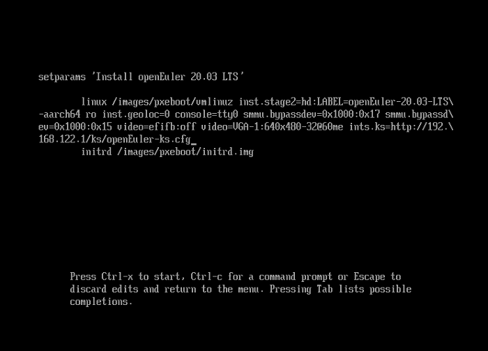
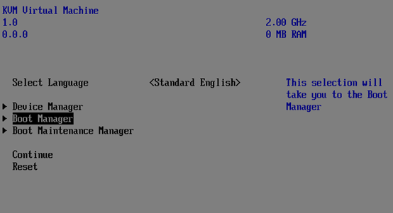

# Using Kickstart for Automatic Installation
<!-- TOC -->

- [Using Kickstart for Automatic Installation](#using-kickstart-for-automatic-installation)
     - [Introduction](#introduction)
        - [Overview](#overview)
        - [Advantages and Disadvantages](#advantages-and-disadvantages)
        - [Background](#background)
    - [Semi-automatic Installation Guide](#semi-automatic-installation-guide)
        - [Environment Requirements](#environment-requirements)
        - [Procedure](#procedure)
    - [Full-automatic Installation Guide](#full-automatic-installation-guide)
        - [Environment Requirements](#environment-requirements-1)
        - [Procedure](#procedure-1)

<!-- /TOC -->

## Introduction

### Overview

You can use the kickstart tool to automatically install the openEuler OS in either of the following ways:

-   Semi-automatic installation: You only need to specify the location of the kickstart file. Kickstart automatically configures OS attributes such as keyboard, language, and partitions.
-   Automatic installation: The OS is automatically installed.

### Advantages and Disadvantages

[Table 1](#table1388812373315)  lists the advantages and disadvantages of semi-automatic installation and full-automatic installation using kickstart. You can select an installation mode as required.

**Table  1**  Advantages and disadvantages

<a name="table1388812373315"></a>
<table><thead align="left"><tr id="row988915233338"><th class="cellrowborder" valign="top" width="11.91119111911191%" id="mcps1.2.4.1.1"><p id="p688992343311"><a name="p688992343311"></a><a name="p688992343311"></a>Installation Mode</p>
</th>
<th class="cellrowborder" valign="top" width="34.003400340034005%" id="mcps1.2.4.1.2"><p id="p08895233338"><a name="p08895233338"></a><a name="p08895233338"></a>Advantage</p>
</th>
<th class="cellrowborder" valign="top" width="54.085408540854075%" id="mcps1.2.4.1.3"><p id="p688912323314"><a name="p688912323314"></a><a name="p688912323314"></a>Disadvantage</p>
</th>
</tr>
</thead>
<tbody><tr id="row5889132303318"><td class="cellrowborder" valign="top" width="11.91119111911191%" headers="mcps1.2.4.1.1 "><p id="p1588922333319"><a name="p1588922333319"></a><a name="p1588922333319"></a>Semi-automatic installation</p>
</td>
<td class="cellrowborder" valign="top" width="34.003400340034005%" headers="mcps1.2.4.1.2 "><p id="p10889142333314"><a name="p10889142333314"></a><a name="p10889142333314"></a>Services such as TFTP, PXE, and DHCP do not need to be prepared.</p>
</td>
<td class="cellrowborder" valign="top" width="54.085408540854075%" headers="mcps1.2.4.1.3 "><p id="p88891223183319"><a name="p88891223183319"></a><a name="p88891223183319"></a>You need to manually specify the path of the kickstart file.</p>
</td>
</tr>
<tr id="row688917233332"><td class="cellrowborder" valign="top" width="11.91119111911191%" headers="mcps1.2.4.1.1 "><p id="p13889192373312"><a name="p13889192373312"></a><a name="p13889192373312"></a>Full-automatic installation</p>
</td>
<td class="cellrowborder" valign="top" width="34.003400340034005%" headers="mcps1.2.4.1.2 "><p id="p2889102319334"><a name="p2889102319334"></a><a name="p2889102319334"></a>The OS is installed automatically.</p>
</td>
<td class="cellrowborder" valign="top" width="54.085408540854075%" headers="mcps1.2.4.1.3 "><p id="p20889823113311"><a name="p20889823113311"></a><a name="p20889823113311"></a>Services, such as TFTP, DHCPD, and PXE, need to be configured.</p>
</td>
</tr>
</tbody>
</table>

### Background

**Kickstart**

Kickstart is an unattended installation mode. The principle of kickstart is to record typical parameters that need to be manually entered during the installation and generate the configuration file  **ks.cfg**. During the installation, the installation program searches the  **ks.cfg**  configuration file first for required parameters. If no matching parameters are found, you need to manually configure these parameters. If all required parameters are covered by the kickstart file, automatic installation can be achieved by only specifying the path of the kickstart file.

Both full-automatic or semi-automatic installation can be achieved by kickstart.

**PXE**

Pre-boot Execution Environment \(PXE\)\) works in client/server network mode. The PXE client can obtain an IP address from the DHCP server during the startup and implement client boot and installation through the network based on protocols such as trivial file transfer protocol \(TFTP\).

**TFTP**

TFTP is used to transfer simple and trivial files between clients and the server.

## Semi-automatic Installation Guide

### Environment Requirements

The environment requirements for semi-automatic installation of openEuler using kickstart are as follows:

-   PM/VM \(for details about how to create VMs, see the documents from corresponding vendors\): includes the computer where kickstart is used for automatic installation and the computer where the kickstart tool is installed.
-   Httpd: stores the kickstart file.
-   ISO: openEuler-20.03-LTS-SP1-aarch64-dvd.iso

### Procedure

To use kickstart to perform semi-automatic installation of openEuler, perform the following steps:

**Environment Preparation**

> **NOTE:**   
>Before the installation, ensure that the firewall of the HTTP server is disabled. Run the following command to disable the firewall:  
>```  
>iptables -F  
>```  

1.  Install httpd and start the service.

    ```
    # dnf install httpd -y
    # systemctl start httpd
    # systemctl enable httpd
    ```

2.  Run the following commands to prepare the kickstart file:

    ```
    # mkdir /var/www/html/ks
    #vim /var/www/html/ks/openEuler-ks.cfg ===>The file can be obtained by modifying the anaconda-ks.cfg file automatically generated from openEuler, or can be created using the system-config-kickstart tool.
    ====================================
    ***Modify the following information as required.***
    #version=DEVEL
    ignoredisk --only-use=sda
    autopart --type=lvm
    # Partition clearing information
    clearpart --none --initlabel
    # Use graphical install
    graphical
    # Use CDROM installation media
    cdrom
    # Keyboard layouts
    keyboard --vckeymap=cn --xlayouts='cn'
    # System language
    lang zh_CN.UTF-8
    
    # Network information
    network  --bootproto=dhcp --device=enp4s0 --ipv6=auto --activate
    network  --hostname=openeuler.com
    # Root password
    rootpw --iscrypted $6$fQE83lxEZ48Or4zc$j7/PlUMHn29yTjCD4Fi44WTZL/RzVGxJ/7MGsZMl6QfE3KjIVT7M4UrhFXbafvRq2lUddAFcyWHd5WRmXfEK20
    # Run the Setup Agent on first boot
    firstboot --enable
    # Do not configure the X Window System
    skipx
    # System services
    services --disabled="chronyd"
    # System timezone
    timezone Asia/Shanghai --isUtc--nontp
    
    %packages
    @^minimal-environment
    @standard
    
    %end
    
    %anaconda
    pwpolicy root --minlen=8 --minquality=1 --notstrict --nochanges --notempty
    pwpolicy user --minlen=8 --minquality=1 --notstrict --nochanges --emptyok
    pwpolicy luks --minlen=8 --minquality=1 --notstrict --nochanges --notempty
    %end
    
    %post
    #enable kdump
    sed  -i "s/ ro / ro crashkernel=1024M,high /" /boot/efi/EFI/openEuler/grub.cfg
    %end
    =====================================
    ```

    > **NOTE:**   
    >The method of generating the password ciphertext is as follows:  
    >\# python3  
    >Python 3.7.0 \(default, Apr  1 2019, 00:00:00\)  
    >\[GCC 7.3.0\] on linux  
    >Type "help", "copyright", "credits" or "license" for more information.  
    >\>\>\> import crypt  
    >\>\>\> passwd = crypt.crypt\("myPasswd"\)  
    >\>\>\> print\(passwd\)  
    >$6$63c4tDmQGn5SDayV$mZoZC4pa9Jdt6/ALgaaDq6mIExiOO2EjzomB.Rf6V1BkEMJDcMddZeGdp17cMyc9l9ML9ldthytBEPVcnboR/0  

3.  Mount the ISO image file to the CD-ROM drive of the computer where openEuler is to be installed.

    If you want to install openEuler through the NFS, specify the path \(which is  **cdrom**  by default\) of installation source in the kickstart file.


**Installing the System**

1.  The installation selection dialog box is displayed. 
    1.  On the installation wizard page in [Starting the Installation](./installation-guideline.html#starting-the-installation), select  **Install openEuler 20.03 LTS SP1**  and press  **e**.
    2.  Add  **inst.ks=http://server ip/ks/openEuler-ks.cfg**  to the startup parameters.

        

    3.  Press  **Ctrl**+**x**  to start the automatic installation.

2.  Verify that the installation is complete.

    After the installation is complete, the system automatically boots. If the first boot option of the system is set to the CD_ROM, the installation page is displayed again. Shut down the computer and change startup option to start from the hard disk preferentially.

    


## Full-automatic Installation Guide

### Environment Requirements

The environment requirements for full-automatic installation of openEuler using kickstart are as follows:

-   PM/VM \(for details about how to create VMs, see the documents from corresponding vendors\): includes the computer where kickstart is used for automatic installation and the computer where the kickstart tool is installed.
-   Httpd: stores the kickstart file.
-   TFTP: provides vmlinuz and initrd files.
-   DHCPD/PXE: provides the DHCP service.
-   ISO: openEuler-20.03-LTS-SP1-aarch64-dvd.iso

### Procedure

To use kickstart to perform full-automatic installation of openEuler, perform the following steps:

**Environment Preparation**

> **NOTE:**   
>Before the installation, ensure that the firewall of the HTTP server is disabled. Run the following command to disable the firewall:  
>```  
>iptables -F  
>```  

1.  Install httpd and start the service.

    ```
    # dnf install httpd -y
    # systemctl start httpd
    # systemctl enable httpd
    ```

2.  Install and configure TFTP.

    ```
    # dnf install tftp-server -y
    # vim /etc/xinetd.d/tftp
    service tftp
    {
    socket_type = dgram
    protocol = udp
    wait = yes
    user = root
    server = /usr/sbin/in.tftpd
    server_args = -s /var/lib/tftpboot
    disable = no
    per_source = 11
    cps = 100 2
    flags = IPv4
    }
    # systemctl start tftp
    # systemctl enable tftp
    # systemctl start xinetd
    # systemctl status xinetd
    # systemctl enable xinetd
    ```

3.  <a name="en-us_topic_0229291289_l1692f6b9284e493683ffa2ef804bc7ca"></a>Run the following commands to prepare the installation source:

    ```
    # mount openEuler-20.03-LTS-SP1-aarch64-dvd.iso /mnt
    # cp -r /mnt/* /var/www/html/openEuler/
    ```

4.  Set and modify the kickstart configuration file  **openEuler-ks.cfg**. Select the HTTP installation source by referring to  [3](#en-us_topic_0229291289_l1692f6b9284e493683ffa2ef804bc7ca).

    ```
    #vim  /var/www/html/ks/openEuler-ks.cfg
    ====================================
    ***Modify the following information as required.***
    #version=DEVEL
    ignoredisk --only-use=sda
    autopart --type=lvm
    # Partition clearing information
    clearpart --none --initlabel
    # Use graphical install
    graphical
    # Keyboard layouts
    keyboard --vckeymap=cn --xlayouts='cn'
    # System language
    lang zh_CN.UTF-8
    #Use http installation source
    url  --url=//192.168.122.1/openEuler/
    %post
    #enable kdump
    sed  -i "s/ ro / ro crashkernel=1024M,high /" /boot/efi/EFI/openEuler/grub.cfg
    %end
    ...
    ```

5.  Modify the PXE configuration file  **grub.cfg**  as follows:

    ```
    # cp -r /mnt/images/pxeboot/* /var/lib/tftpboot/
    # cp /mnt/EFI/BOOT/grubaa64.efi /var/lib/tftpboot/
    # cp /mnt/EFI/BOOT/grub.cfg /var/lib/tftpboot/
    # ls /var/lib/tftpboot/
    grubaa64.efi  grub.cfg  initrd.img  TRANS.TBL  vmlinuz
    # vim /var/lib/tftpboot/grub.cfg
    set default="1"
    
    function load_video {
      if [ x$feature_all_video_module = xy ]; then
        insmod all_video
      else
        insmod efi_gop
        insmod efi_uga
        insmod ieee1275_fb
        insmod vbe
        insmod vga
        insmod video_bochs
        insmod video_cirrus
      fi
    }
    
    load_video
    set gfxpayload=keep
    insmod gzio
    insmod part_gpt
    insmod ext2
    
    set timeout=60
    
    
    ### BEGIN /etc/grub.d/10_linux ###
    menuentry 'Install openEuler 20.03 LTS SP1' --class red --class gnu-linux --class gnu --class os {
            set root=(tftp,192.168.1.1)
            linux /vmlinuz ro inst.geoloc=0 console=ttyAMA0 console=tty0 rd.iscsi.waitnet=0 inst.ks=http://192.168.122.1/ks/openEuler-ks.cfg
            initrd /initrd.img
    }
    ```

6.  Run the following commands to configure DHCP \(which can be replaced by DNSmasq\):

    ```
    # dnf install dhcp -y
    #
    # DHCP Server Configuration file.
    #   see /usr/share/doc/dhcp-server/dhcpd.conf.example
    #   see dhcpd.conf(5) man page
    #
    # vim /etc/dhcp/dhcpd.conf
    ddns-update-style interim;
    ignore client-updates;
    filename "grubaa64.efi";  # pxelinux location of the startup file;
    next-server 192.168.122.1;     # (IMPORTANT) TFTP server IP address;
    subnet 192.168.122.0 netmask 255.255.255.0 {
    option routers 192.168.111.1; # Gateway address
    option subnet-mask 255.255.255.0; # Subnet mask
    range dynamic-bootp 192.168.122.50 192.168.122.200; # Dynamic IP address range
    default-lease-time 21600;
    max-lease-time 43200;
    }
    # systemctl start dhcpd
    # systemctl enable dhcpd
    ```


**Installing the System**

1.  On the  **Start boot option**  screen, press  **F2**  to boot from the PXE and start automatic installation.

    

    

    

2.  The automatic installation window is displayed.
3.  Verify that the installation is complete.

    

